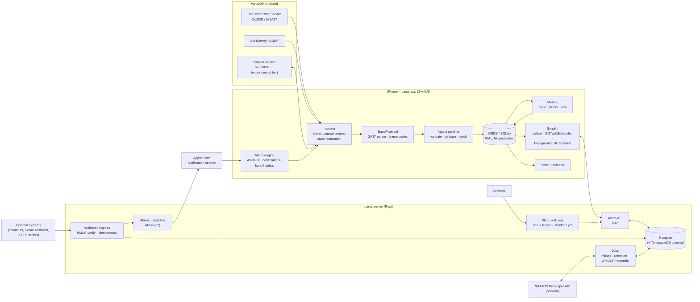
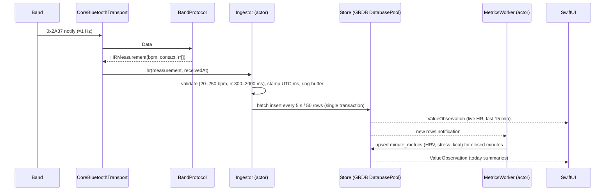
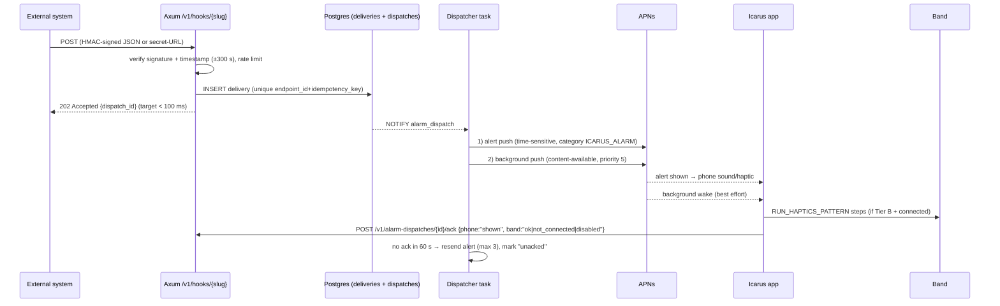

# Icarus — Build Plan

Status: **Draft for approval** · Owner: Caleb Brown (`cnbrown04`) · Repo: `cnbrown04/Icarus` · Plan date: 2026-10-07

Icarus is a personal, local-first companion for a WHOOP 4.0 band you own: a SwiftUI iOS app that reads the band over Bluetooth LE, stores data offline, derives heart-rate, stress and calorie metrics, fires alarms and haptics, and syncs to a Rust/Postgres backend with a ShadCN (Lyra) website.

This document is the single source of truth for scope, architecture, research findings and milestones. Nothing in it is built yet. Phase 0 (scaffolding plus CI screenshots) starts only after Caleb approves.

---

## Contents

1. [Summary of decisions](#1-summary-of-decisions)
2. [Overview, goals, non-goals](#2-overview-goals-non-goals)
3. [Confidence legend](#3-confidence-legend)
4. [Architecture](#4-architecture)
5. [WHOOP research findings](#5-whoop-research-findings)
6. [Legal, ToS and safety](#6-legal-tos-and-safety)
7. [iOS app architecture](#7-ios-app-architecture)
8. [Derived metrics](#8-derived-metrics)
9. [Alarms and haptics](#9-alarms-and-haptics)
10. [Data model](#10-data-model)
11. [Sync design](#11-sync-design)
12. [API (Rust / Axum)](#12-api-rust--axum)
13. [Website](#13-website)
14. [App screens](#14-app-screens)
15. [Design rules](#15-design-rules)
16. [CI and screenshot pipeline](#16-ci-and-screenshot-pipeline)
17. [Testing strategy](#17-testing-strategy)
18. [Security and privacy](#18-security-and-privacy)
19. [Milestones](#19-milestones)
20. [Open questions for Caleb](#20-open-questions-for-caleb)
21. [Risk register](#21-risk-register)
22. [Sources](#22-sources)

---

## 1. Summary of decisions

| Area | Decision | Why (short) |
|---|---|---|
| Band link (default) | Standard Bluetooth **Heart Rate Service `0x180D` / Heart Rate Measurement `0x2A37`** | Published Bluetooth SIG profile. Community reports say it carries HR and R-R on WHOOP 4.0 without bonding. No reverse engineering needed. |
| Band link (opt-in) | Community-documented WHOOP custom GATT service (`61080001-…`) behind an **Experimental** flag, off by default | Only route to band haptics, the band's firmware alarm, battery and history offload. Undocumented by WHOOP and touches WHOOP ToS, so Caleb decides (§6, §20). |
| Local storage | **SQLite via GRDB.swift** | High-rate append-only time series, explicit SQL and indexes, WAL concurrency, deterministic migrations, and it is what the two most complete community WHOOP iOS clients use. Reasoning in §7.4. |
| iOS stack | SwiftUI + Observation, Swift 6, CoreBluetooth, BackgroundTasks, AlarmKit, UserNotifications; project generated with **XcodeGen** | Fully SwiftUI as requested. A generated project avoids `.pbxproj` merge pain when nobody has a Mac. |
| Min iOS | **iOS 26** (proposed) | AlarmKit is iOS 26+, and the CI runners ship iOS 26.x simulators. Caleb confirms his phone's iOS version (§20). |
| Backend | **Rust + Axum 0.8.x + sqlx + Postgres** | Axum sits on tower/tokio middleware, and sqlx checks queries at compile time. Nothing else is clearly better for this workload (§4.3). |
| Time series in Postgres | Plain Postgres with monthly partitions and BRIN indexes. **TimescaleDB optional** if the host supports the extension. | About 86k HR rows a day for one user is small. Timescale adds compression and continuous aggregates but limits hosting choices. |
| Website | Vite + React + TypeScript SPA, **shadcn/ui initialised with the `lyra` preset**, served by Axum. Lyra CSS is never edited. | Lyra is shadcn's "boxy and sharp" style with radius forced to `none`. One Rust binary serves the API and the static site. |
| Push | APNs over HTTP/2 from Rust (`a2` crate, `.p8` token auth) | Wakes or alerts the phone when a webhook fires. |
| CI | GitHub Actions: Linux for Rust, web and pure-Swift packages; **macOS runners (`macos-26`, Xcode 26.6)** for app build, UI tests and Simulator screenshots | No Mac available. Screenshots are XCUITest attachments, exported with `xcresulttool` and uploaded as artifacts. |
| Repo visibility | **Private** (per brief), with a cost caveat: macOS minutes are expensive on private repos (§16.7, §20) | Health data and tokens. Caleb may choose public to get free macOS minutes. |
| WHOOP cloud API | Optional Phase 7 integration, off by default | Gives recovery, sleep and strain summaries but no live HR. API ToS limits storing copies and competing products (§6.3). |

---

## 2. Overview, goals, non-goals

### 2.1 Problem

Caleb wants WHOOP-like functionality on hardware he already owns, with his data on infrastructure he controls, plus features WHOOP lacks: webhook-triggered alarms and custom vibration rhythms.

### 2.2 Goals (MVP)

1. **Live heart rate** from the WHOOP 4.0 band on iPhone, recorded continuously (foreground and background) to local storage.
2. **HRV-based stress level**, computed on device from R-R intervals, with clear "calibrating" and "insufficient data" states.
3. **Calorie burn** (resting plus active), computed on device from HR and profile.
4. **Alarms and haptics**:
   - scheduled alarms;
   - alarms triggered by external webhooks or notifications;
   - delivery on the phone (always) and on the band (when the experimental band channel is enabled and the band is connected).
5. **Offline-first**: works with no network and syncs to Postgres on an interval.
6. **Website**: history, trends, alarms and webhook management, devices, settings.
7. **Tests** for app, web and backend, all running in CI.
8. **Screenshots in CI** on every meaningful iOS/web change so Caleb sees progress without a Mac.

### 2.3 Non-goals (for now)

- Cloning WHOOP's proprietary Recovery, Strain or Sleep scores. We compute our own clearly labelled metrics from published methods.
- Sleep staging, SpO₂, skin temperature, respiratory rate. Possible later via the community protocol's history records, but not MVP (§5.5).
- WHOOP 5.0 / MG support. It uses a different service and session handshake (§5.3.7).
- Firmware updates, flashing, or any destructive band command (§5.3.5).
- Multi-tenant SaaS. Single user, built so a second user would not need a rewrite.
- Android. Apple Watch app (only listed as a fallback, §9.4).
- App Store distribution. TestFlight or personal builds only (§20).
- Medical use. Icarus is not a medical device, and the UI says so once in Settings, not on every screen.

---

## 3. Confidence legend

Every protocol or platform claim in this plan carries one of these tags:

- **[Official]**: documented by WHOOP, Apple, Bluetooth SIG, GitHub, or the library's own docs, in a source we fetched.
- **[Community-verified]**: documented by community projects, and we cross-checked it ourselves (e.g. recomputed checksums on published frames) or two independent projects agree.
- **[Community]**: documented by one community project. Plausible but not independently confirmed.
- **[Unverified]**: our inference, a conflict between sources, or something not found in any fetched source. Must be checked on Caleb's band or device.

---

## 4. Architecture

### 4.1 System diagram



### 4.2 Monorepo layout

```text
Icarus/
├── PLAN.md                      # this file
├── README.md                    # how to run each part locally
├── docs/
│   ├── adr/                     # Architecture Decision Records (0001-grdb.md, 0002-axum.md, …)
│   ├── protocol/                # our notes on the band protocol, every line sourced
│   ├── design-rules.md          # §15, kept in sync
│   └── screenshots.md           # how to fetch CI screenshots
├── ios/
│   ├── project.yml              # XcodeGen spec (the .xcodeproj is generated, not committed)
│   ├── Icarus/                  # app target: SwiftUI views, app lifecycle, DI
│   ├── IcarusUITests/           # XCUITest flows + screenshot tests
│   ├── Packages/
│   │   ├── BandProtocol/        # pure Swift: 2A37 parser, frame codec, CRCs. Builds on Linux.
│   │   ├── Metrics/             # pure Swift: RR cleaning, HRV, stress, kcal. Builds on Linux.
│   │   ├── BandKit/             # CoreBluetooth transport + FixtureTransport/SyntheticTransport
│   │   ├── Store/               # GRDB schema, migrations, repositories
│   │   ├── SyncKit/             # outbox, API client, background tasks
│   │   └── AlarmKitBridge/      # AlarmKit / notifications / band haptic routing
│   └── Fixtures/                # recorded and synthetic band sessions (NDJSON), seed DBs
├── server/
│   ├── Cargo.toml               # workspace
│   ├── crates/
│   │   ├── icarus-api/          # Axum routers, extractors, auth, OpenAPI
│   │   ├── icarus-core/         # domain types, metrics (Rust port of Metrics for parity)
│   │   ├── icarus-db/           # sqlx queries, migrations
│   │   ├── icarus-push/         # APNs dispatch
│   │   └── icarus-jobs/         # rollups, retention, WHOOP reconcile
│   └── migrations/
├── web/
│   ├── components.json          # shadcn config (lyra preset)
│   ├── src/
│   └── tests/                   # Vitest + Playwright
├── shared/
│   ├── openapi.yaml             # API contract, generated from server, checked in CI
│   └── golden/                  # shared metric fixtures: Swift and Rust must match
└── .github/workflows/
    ├── swift-packages.yml       # Linux: swift test for BandProtocol + Metrics
    ├── ios.yml                  # macOS: build + unit + UI tests
    ├── ios-screenshots.yml      # macOS: Simulator screenshot matrix → artifacts
    ├── server.yml               # Linux: fmt, clippy, tests vs Postgres service
    ├── web.yml                  # Linux: lint, typecheck, Vitest, Playwright, web screenshots
    └── testflight.yml           # macOS: archive + TestFlight upload (Phase 1)
```

### 4.3 Technology choices and justification

**SwiftUI + Observation.** The brief asks for all SwiftUI. We use `@Observable` models and plain dependency injection, with no third-party architecture framework, to keep dependencies minimal.

**XcodeGen.** Nobody can open Xcode, so the project file must be generated from a reviewable YAML spec in CI. The my-whoop project also generates its iOS project with XcodeGen/SwiftPM [S14]. Tuist is the alternative if XcodeGen falls short.

**GRDB over SwiftData / Core Data.** See §7.4.

**Axum.** Axum is "an HTTP routing and request-handling library that focuses on ergonomics and modularity", built on `tower::Service`, so it "gets timeouts, tracing, compression, authorization, and more, for free" [S34] [Official].
- Released line: **0.8.x**. `main` is working toward 0.9 with breaking changes, so we pin 0.8.x [S34] [Official].
- Alternatives considered: actix-web (own actor/runtime conventions, less tower reuse) and Loco (Rails-like, more opinion than a single-user API needs). Neither is clearly better here.

**sqlx.** Async, pure Rust, compile-time checked queries without a DSL, embedded migrations, Postgres `LISTEN/NOTIFY` support [S35] [Official].
- `LISTEN/NOTIFY` doubles as a lightweight in-process job wake-up, so v1 needs no Redis.

**Vite + React SPA over Next.js.** The backend is Rust, so a static SPA served by Axum avoids running a second (Node) server. shadcn's new styles support Vite [S38] [Official].

**shadcn Lyra.**
- Lyra is one of the five styles launched with `npx shadcn create`: "Boxy and sharp. Pairs well with mono fonts." [S38] [Official].
- The named preset is `lyra`: `npx shadcn@latest init --preset lyra` [S39] [Official].
- Preset defaults: neutral base colour, Phosphor icons, JetBrains Mono [S40] [Official].
- The create UI forces `radius` to `none` when the style is `lyra` [S41] [Official].

---

## 5. WHOOP research findings

### 5.1 What exists, at a glance

| Source | What it gives | Status |
|---|---|---|
| WHOOP Developer API (cloud) | OAuth 2.0, v2 REST endpoints for cycles, recovery, sleep, workouts, profile, body measurements; webhooks | [Official] [S1–S5] |
| Bluetooth SIG Heart Rate Service on the band | Live HR (and R-R per community reports) via standard `0x180D`/`0x2A37` | Profile [Official] [S19]; behaviour on WHOOP 4.0 [Community-verified] [S9][S12][S15] |
| WHOOP "HR Broadcast" toggle | User-facing setting in the WHOOP app that exposes HR to third-party apps (Strava, Zwift, Peloton) | Third-party article [S18]; WHOOP support page did not render for our fetcher [Unverified content] |
| Community reverse engineering of the custom service | Command/response protocol, events, history offload, haptics, alarm | [Community] / [Community-verified], see §5.3 |
| WHOOP published BLE docs for the custom service | **None found.** WHOOP does not document the custom GATT protocol. | — |

### 5.2 Official WHOOP Developer API [Official]

Source pages: API reference [S1], OAuth [S2], webhooks [S3], rate limiting [S4], getting started [S5].

**OAuth 2.0 (authorization code)**
- Authorization URL: `https://api.prod.whoop.com/oauth/oauth2/auth`.
- Token URL: `https://api.prod.whoop.com/oauth/oauth2/token`.
- The `state` parameter must be 8 characters if you generate it yourself.
- Refresh tokens are issued only if the `offline` scope is requested.
- Refreshing **invalidates** the previous access and refresh token. Concurrent refreshes race, so refresh must be serialised, e.g. one background job [S2].
- Example `expires_in` is 3600 s [S2].
- The client secret must stay server-side and never ship in a mobile or web client [S5].

**Scopes:** `read:recovery`, `read:cycles`, `read:workout`, `read:sleep`, `read:profile`, `read:body_measurement`, plus `offline` for refresh tokens [S1][S2]. A separate client-credentials "Trusted Partner" scheme exists for lab partners and is irrelevant to us [S1].

**Endpoints seen in the API reference (v2)** [S1]:
- `GET /v2/user/measurement/body`: height, weight, `max_heart_rate`.
- `GET /v2/cycle/{cycleId}`: cycle with `score.strain`, `kilojoule`, `average_heart_rate`, `max_heart_rate`; the sample also shows `step_count`.
- `GET /v2/cycle/{cycleId}/sleep`, `GET /v2/cycle/{cycleId}/recovery`.
- `GET /v2/activity/sleep/{sleepId}`: stage summary, sleep need, respiratory rate, performance/consistency/efficiency.
- `GET /v2/activity/workout/{workoutId}`: strain, avg/max HR, kJ, distance, zone durations.
- `GET /v1/activity-mapping/{activityV1Id}`: maps v1 activity IDs to v2 UUIDs.
- Collections exist as `getCycleCollection`, `getRecoveryCollection`, `getSleepCollection` and `getWorkoutCollection`, paginated with `limit` ≤ 25, `start`, `end`, `nextToken`. Their exact paths were not shown in the fetched text [Unverified paths]; we read them from the downloadable OpenAPI spec at implementation time.
- "Get Basic User Profile" and `revokeUserOAuthAccess` also exist [S1].

**What the API does *not* give:** any raw or second-by-second heart-rate stream, R-R intervals, or live data. It returns scored summaries:
- recovery score, RHR, `hrv_rmssd_milli`, SpO₂, skin temperature;
- sleep stages;
- strain and kJ [S1].

The API cannot drive the band either: no haptics, alarms or device control. **Live HR, stress and haptics must therefore come from BLE.**

**Webhooks** [S3]:
- Event types: `workout.updated|deleted`, `sleep.updated|deleted`, `recovery.updated|deleted`. Creates arrive as `updated`. There are no webhooks for cycles, day strain or body measurements.
- v2 webhooks carry UUIDs. v1 webhooks are "no longer published".
- Payload: `user_id`, `id`, `type`, `trace_id`. Webhooks notify only, so you must call the API for the data.
- Signature: `base64(HMAC-SHA256(X-WHOOP-Signature-Timestamp + raw_body, client_secret))` compared with `X-WHOOP-Signature`.
- Delivery: retried 5 times over about an hour, so respond 2XX within about a second and process asynchronously. Duplicates are possible (dedupe on `trace_id`), and deliveries can be missed, so run a reconciliation job.

**Rate limits** [S4]: 100 requests/minute and 10,000/day by default, reported via `X-RateLimit-Limit/Remaining/Reset`. Exceeding them returns HTTP 429.

**Apps:** up to 5 apps per team. Redirect URIs must be registered [S5].

### 5.3 Band BLE protocol

#### 5.3.1 Standard GATT services (no reverse engineering required)

| Service | UUID | Characteristic | Use | Status |
|---|---|---|---|---|
| Heart Rate | `0x180D` | Heart Rate Measurement `0x2A37` (notify) | HR (8- or 16-bit) + optional R-R intervals | Spec [Official] [S19]; present on WHOOP 4.0 [Community-verified] [S8][S9][S12][S15] |
| Battery | `0x180F` | Battery Level `0x2A19` | Battery % | Present [Community]. **Two sources say it reads a constant 100% stub** [S11][S12], so we treat it as unreliable [Community-verified]. |
| Device Information | `0x180A` | e.g. manufacturer `0x2A29` "WHOOP Inc." | Identity | [Community] [S15] |

**Heart Rate Measurement parsing.** This follows the Bluetooth SIG HRS/GATT definitions [S19] and NOOP's documented parser [S12]:
- byte 0 is flags: bit 0 = HR format (0 → `u8`, 1 → `u16` LE); bits 1–2 = sensor contact status; bit 3 = Energy Expended present (skip `u16`); bit 4 = R-R intervals present;
- then the HR value;
- then optional Energy Expended;
- then zero or more R-R intervals as `u16` LE in **units of 1/1024 s**, so `rr_ms = raw × 1000 / 1024`.

We will write the parser against the SIG spec and test it with spec-derived vectors, not with WHOOP-specific assumptions.

**Observed WHOOP 4.0 behaviour on `0x2A37`:**
- Delivers HR at about 1 Hz without bonding. NOOP and my-whoop say it also carries R-R intervals [S12][S15] [Community-verified: two independent projects].
- NOOP treats `0x2A37` as the "reliable" HR/R-R source, because the custom realtime stream "usually reports `rr_count = 0`" [S12] [Community].
- my-whoop: "This alone is enough for HRV / resting-HR / your own recovery score" [S15] [Community].
- **Conflict [Unverified]:** jmooves found nothing "resembling HRV or beat-to-beat timing" in what the band exposes on the custom channels [S10]. That claim is about the custom channels, but it still means **R-R availability on Caleb's band and firmware must be verified in Phase 1** before we promise stress.

**Does `0x2A37` need "HR Broadcast" turned on?**
- bWanShiTong observed that subscribing to `0x2A37` failed with broadcast off and worked once it was turned on [S8][S9].
- Their notes also say the band "only appears in BLE scans when heart rate broadcast is enabled" [S9].
- jmooves says scans must be filtered by the custom service UUID because a passive scan hides the name and UUID [S11].
- Pocket-lint documents HR Broadcast as a user-facing toggle in the official WHOOP app (device icon → HR Broadcast) [S18].
- **[Unverified]** whether broadcast must be on for our use. Phase 1 tests both states.
  - If it is required, the fully documented path is: Caleb enables HR Broadcast in the official WHOOP app (needs an active membership and the app).
  - The alternative is the community "broadcast toggle" command (category `0x0e`) [S8][S9], which is Tier B (§5.3.6).

#### 5.3.2 Custom GATT service (WHOOP 4.0, "Harvard")

| Role | UUID | Properties | Status |
|---|---|---|---|
| Service | `61080001-8d6d-82b8-614a-1c8cb0f8dcc6` | primary | [Community-verified] [S8][S10][S11][S12][S15] |
| CMD → strap | `61080002-8d6d-82b8-614a-1c8cb0f8dcc6` | write / write-without-response | [Community-verified] |
| CMD ← strap | `61080003-…` | notify | [Community-verified] |
| Events ← strap | `61080004-…` | notify | [Community-verified] |
| Data ← strap | `61080005-…` | notify | [Community-verified] |
| Memfault / diagnostics | `61080007-…` | notify | [Community] [S8][S11][S15] |

Note: my-whoop warns that `christianmeurer/whoop-reader` has a shifted, wrong UUID map and describes it as "fabricated" [S15]. We do not use it.

**Bonding.**
- The custom notify characteristics stay silent until the link is bonded.
- On Apple platforms, one `.withResponse` write to `61080002` triggers OS-level "just works" pairing with no PIN or UI. NOOP uses a benign `GET_BATTERY_LEVEL` for this [S12][S15] [Community-verified: two projects].
- **Conflict:** jmooves says macOS can stream unbonded but "a true bond … needs a platform that can initiate pairing (Linux/BlueZ, or Android `createBond`)" [S11]. iOS behaviour is [Unverified] until the Phase 1 spike.

**One central at a time.**
- jmooves says the band is single-central: the official app must be disconnected or the band won't advertise to you [S11] [Community].
- my-whoop reports the strap "stayed bonded to the user's phone simultaneously without issue" [S15].
- [Unverified] which holds. This decides whether Caleb can run the official WHOOP app alongside Icarus.

#### 5.3.3 Frame envelope (WHOOP 4.0) [Community-verified]

```text
[0xAA][len u16 LE][crc8 over the 2 len bytes, poly 0x07][type u8][seq u8][cmd/event u8][payload…][crc32 LE]
len = (3 + payload.count) + 4        # inner bytes + 4-byte CRC32; total on wire = len + 4
crc32 = standard zlib CRC-32 (reflected, poly 0xEDB88320) over [type][seq][cmd][payload]
```

Sources: NOOP [S12], jmooves [S11] (which pads the inner payload to a multiple of 4), my-whoop [S15].

**Our own cross-check:**
- We took seven complete frames published by bWanShiTong [S8]: HR-broadcast on/off, start activity, set alarm ×2, reboot.
- We recomputed both checksums locally (Python `zlib.crc32` plus a CRC-8/poly-0x07 routine).
- **All seven match** the envelope that NOOP, jmooves and my-whoop describe.
- Phase 0 update (2026-10-08): the same README publishes 80 complete frames (commands, realtime, events, metadata, history). All 80 pass both checksums with standard zlib CRC-32 over the inner bytes, and all are in `shared/golden/frames.json`.

That ties four independent write-ups to one format. bWanShiTong's "custom CRC-32 parameters" (xor-out `0xF43F44AC`) are the same CRC computed over the whole frame instead of the inner bytes. These frames become golden test vectors in `BandProtocol`.

**Reassembly must be length-based.** Large frames (history ~96–104 B, raw ~1.9 KB) span several notifications. Payloads contain `0xAA` bytes, so "resync on 0xAA" corrupts records [S11][S12][S15] [Community-verified].

#### 5.3.4 Packet types and key commands

Packet types (inner byte 0): `0x23` COMMAND, `0x24` COMMAND_RESPONSE, `0x28` REALTIME_DATA, `0x2B` REALTIME_RAW_DATA, `0x2F` HISTORICAL_DATA, `0x30` EVENT, `0x31` METADATA, `0x32` CONSOLE_LOGS [S11][S12] [Community-verified].

Commands relevant to Icarus. Decimal values, from NOOP [S12], jmooves [S11] and my-whoop [S15]:

| Cmd | Name | Purpose for Icarus | Status |
|---|---|---|---|
| 3 (`0x03`) | TOGGLE_REALTIME_HR | Live HR on the custom channel | [Community-verified]: name in [S11][S12]; byte `0x03` in bWanShiTong's frames [S8] |
| 14 (`0x0e`) | (HR broadcast toggle) | Turn standard HR broadcast on/off | [Community] [S8][S9]; frames CRC-verified by us |
| 10 / 11 | SET_CLOCK / GET_CLOCK | Keep the band RTC correct (needed for alarms and history timestamps) | [Community]. **The SET_CLOCK payload length varies by firmware** (8 vs 9 bytes; a wrong length is acked but not latched) [S12] |
| 22 / 23 | SEND_HISTORICAL_DATA / HISTORICAL_DATA_RESULT | Offload the band's on-device history with batch ACKs | [Community-verified] [S11][S12][S15]; ACK layouts differ slightly between write-ups [Unverified detail] |
| 26 | GET_BATTERY_LEVEL | Battery (u16 ÷ 10 = %) | [Community-verified] [S11][S15]; one report says it is silent on some recent firmware [S12] |
| 34 | GET_DATA_RANGE | History window | [Community-verified] |
| 66 (`0x42`) | SET_ALARM_TIME | Arm the **band's firmware alarm** (UTC unix); buzzes even if the app is not running | [Community-verified]: name and behaviour in [S12]; byte `0x42` + u32 unix payload in bWanShiTong's CRC-valid alarm frames [S8] |
| 67 | GET_ALARM_TIME | Read the armed alarm | [Community] [S11][S15] |
| 79 | RUN_HAPTICS_PATTERN | Buzz now: payload `[patternId, numLoops, 0, 0, 0]`; NOOP uses `patternId = 2` | **[Community], single source** [S12]; no captured 4.0 frame to cross-check |
| 80 | GET_ALL_HAPTICS_PATTERN | List built-in presets ("7 presets on 4.0", but NOOP says it has never actually sent this command) | [Community], unconfirmed [S12] |
| 122 | STOP_HAPTICS | Cancel a running pattern | [Community] [S12] |

Events of interest [S11][S12]: `WRIST_ON` 9 / `WRIST_OFF` 10, `DOUBLE_TAP` 14, `CHARGING_ON/OFF` 7/8, `BATTERY_LEVEL` 3, `BLE_BONDED` 23, `RTC_LOST` 13, `STRAP_DRIVEN_ALARM_EXECUTED` 57, `HAPTICS_FIRED` 60.

#### 5.3.5 Commands Icarus must never send (hard denylist in code)

| Cmd | Name | Why | Status |
|---|---|---|---|
| 25 (`0x19`) | FORCE_TRIM | Flash erase, destructive | [Community-verified]: [S11] plus bWanShiTong's "erase device" frames use `0x19` [S8] |
| 29 (`0x1D`) | REBOOT_STRAP | Hard reset. Manual recovery only, never automatic | [Community-verified]: [S11] plus bWanShiTong's reboot frames use `0x1d` [S8] |
| 154 (`0x9A`) | TOGGLE_PERSISTENT_R21 | Forces optical LEDs on across reboots ("stuck LED") | [Community] [S11] |
| — | firmware load, ship mode, power cycle, fuel-gauge reset, BLE DFU | Can brick or wipe | [Community] [S12] (NOOP excludes them by design) |
| 108 / 131 | TOGGLE_OPTICAL_MODE / SET_RESEARCH_PACKET | Not needed; changes sensor behaviour | [Community] [S15] |

The frame builder takes a whitelist enum (`SafeCommand`). Opcodes outside it cannot be constructed, and a unit test asserts the denylist is unreachable.

#### 5.3.6 Access tiers Icarus will implement

| Tier | Channel | Gives | Requirements | Default |
|---|---|---|---|---|
| **A** | Standard HRS `0x2A37` (+ `0x180F`) | Live HR, R-R (to verify), contact flag | Nothing proprietary. May need HR Broadcast on in the WHOOP app (to verify). | **On** |
| **B** | Community-documented custom service | Band haptics (79/122), band firmware alarm (66/67), clock (10/11), battery (26), wrist/double-tap/charging events, history offload (22/23), broadcast toggle (14) | Caleb's explicit opt-in after reading §6. Implemented only from published community docs. | **Off** (Experimental toggle in Device screen) |

#### 5.3.7 What we found about other generations

WHOOP 5.0 / MG uses service `fd4b0001-cce1-4033-93ce-002d5875f58a`, a CRC16-Modbus header, a static `CLIENT_HELLO` frame, and a different haptic opcode (19 "maverick"); it rejects command 79 [S12][S16][S17] [Community]. Out of scope for Icarus.

### 5.4 Feasibility matrix

| Feature | Path | Feasible without circumventing DRM/encryption/auth? | Confidence |
|---|---|---|---|
| Live HR | Tier A `0x2A37` | **Yes** | High [Community-verified] |
| R-R intervals → HRV | Tier A `0x2A37` | **Likely yes** | Medium. Two projects say yes [S12][S15]; must verify on device |
| Stress level | Derived from R-R + HR | Yes if R-R present. Otherwise only a degraded HR-only proxy. | Medium |
| Calorie burn | Derived from HR + profile | **Yes** | High (method), with large estimation error (§8.4) |
| Battery % | Tier B cmd 26 (std `0x2A19` reportedly stuck at 100) | Tier B only | Medium |
| Band haptic buzz now | Tier B cmd 79 | Technically yes. 4.0 custom traffic is plain CRC-framed with OS "just works" pairing and no app-level auth is documented. **Undocumented by WHOOP; ToS implications (§6).** | Low–medium (single source) |
| **Custom** vibration waveforms on the band | — | **No documented way.** Only built-in presets × loop counts are known. "Custom" means app-timed sequences of preset buzzes, which needs the app awake and connected. | [Unverified] |
| Band firmware alarm (fires with app closed) | Tier B cmd 66 | Technically yes, same caveats | Medium (cross-verified frame format) |
| Webhook → band buzz | Server → APNs → app wakes → Tier B cmd 79 | Partly. iOS background-push delivery is best effort and throttled (§9.3). | Low–medium |
| Webhook → phone alert/haptic | Server → APNs time-sensitive alert | **Yes** | High [Official] |
| Phone alarms that pierce silent mode | AlarmKit (iOS 26) | **Yes** | High [Official] |
| WHOOP recovery/sleep/strain | WHOOP API | Yes (OAuth, user consent). ToS limits on storage and competing use (§6.3) | High [Official] |
| WHOOP proprietary scores computed locally | — | **No.** Computed in WHOOP's cloud, never on the wire [S10][S11] | High |
| SpO₂ / skin temp / resp. rate from band | Tier B history records | Partly, empirical offsets only [S11][S12][S15] | Low. Non-goal for MVP |

### 5.5 Contradictions and unknowns to resolve on hardware (Phase 1 checklist)

1. Does `0x2A37` stream with HR Broadcast **off**? Is the band discoverable at all with it off? [S9] vs [S11][S12]
2. Does `0x2A37` include R-R intervals (flag bit 4) on Caleb's firmware, and what fraction of seconds carry ≥1 R-R? [S12][S15] vs [S10]
3. Does a `.withResponse` write from **iOS** bond the custom service (look for the `BLE_BONDED` event)? [S12][S15] vs [S11]
4. Can the official WHOOP app and Icarus be connected at the same time? [S11] vs [S15]
5. Which SET_CLOCK payload length does Caleb's firmware latch (8 or 9 bytes)? [S12]
6. Does RUN_HAPTICS_PATTERN 79 with `[2, n, 0, 0, 0]` buzz a WHOOP 4.0, and what does GET_ALL_HAPTICS_PATTERN 80 return? [S12]
7. Firmware version (REPORT_VERSION_INFO 7), recorded with every fixture.

### 5.6 Sources seen but not relied on

- `bWanShiTong/openwhoop`, `jogolden/whoomp`, Gadgetbridge issue #5731, `tanarchytan/whoop-rs`: cited by other projects [S14][S15][S17]. Their raw READMEs were not retrievable by our fetcher, so we did not read them and nothing in this plan depends on them.
- `christianmeurer/whoop-reader`: flagged by my-whoop as wrong or fabricated [S15]. Excluded.
- `NoopApp/noop` URLs from search results returned 404. We cite the `ryanbr/noop` copy pinned at commit `ef165de4` instead [S12][S13].

---

## 6. Legal, ToS and safety

> This section is engineering risk analysis, not legal advice. Caleb should decide the Tier B question with that in mind.

### 6.1 Commitments (non-negotiable)

1. **We will not circumvent DRM, encryption, or authentication.**
   - We will not break, bypass or emulate any cryptographic protection, session token, account check or paywall.
   - If a firmware update adds app-level encryption or authentication to the WHOOP 4.0 custom service, Tier B stops and we fall back to Tier A plus phone-side features.
2. **We will not decompile or disassemble WHOOP software.** We implement only from published sources: Bluetooth SIG specs, WHOOP's developer docs, and community documentation.
3. **We will not copy community code.**
   - NOOP is PolyForm Noncommercial [S13]. We read its *documentation of protocol facts* and write our own code.
   - jmooves/research is MIT [S10]. Even so, we re-implement rather than vendor its code.
4. **We will not use decompile-derived expression.**
   - Some community facts trace back to decompiled apps. bWanShiTong notes characteristic names "were gotten from the decompiled apk" [S8]; whoop-local tags sources as "decompiled" [S17].
   - We will not reuse decompile-sourced *formulas* (e.g., whoop-local's strain formula attributed to a decompiled WHOOP app class) or magic strings. Metrics use published science only (§8).
5. **Destructive band commands are unreachable in code** (§5.3.5).
6. **Personal use only.** No WHOOP trademarks or logos in the UI. The band appears as "WHOOP 4.0" only where we identify the hardware.

### 6.2 WHOOP Terms of Use (fetched 2026-10-07; "Last Updated: August 3, 2026") [S7]

Section 4.4 prohibits, among other things (clause also tracked by ToS Tracker [S48]):
- "(v) modifying, translating, adapting, merging, making derivative works of, disassembling, decompiling, reverse compiling, or reverse engineering the Services, including any Software, except to the extent this restriction is expressly prohibited by applicable law";
- "(viii) any use of the WHOOP Device for purposes other than the Services".

Section 4.1 licenses the device's embedded software "solely for your personal use" to enable the Services.

**Implications:**
- **Tier A** uses a standard Bluetooth profile that WHOOP exposes for third-party apps (HR Broadcast) [S18]. Lowest risk.
- **Tier B** uses a protocol others reverse-engineered. Using it may conflict with 4.4(v)/(viii) even though *we* do not reverse-engineer anything. Risks: account termination, warranty (§19 of ToU ties warranty to an active membership), and band firmware behaviour changes.
- Community projects claim protection under 17 U.S.C. §1201(f) interoperability [S14]. We do not rely on that claim.

### 6.3 WHOOP API Terms of Use [S6]

Relevant prohibitions in the API terms:
- reverse engineering "any API (or any related or connected software or system)";
- "Circumvent any WHOOP controls or safeguards";
- "Use any API Materials to compete, directly or indirectly, with WHOOP";
- "Scrape, build databases, or otherwise create permanent copies of WHOOP Data, or keep cached copies longer than permitted by the cache header";
- offering features "regulated as a medical device";
- using WHOOP Data to train ML models.

**Implications:**
- The optional WHOOP integration (Phase 7) must **not** persist WHOOP API data indefinitely. Design: show live-fetched values, cache only within cache-header limits, store only our own derived references (e.g., which cycle IDs we have seen) and webhook `trace_id`s for dedupe.
- A product that "replicates much of WHOOP's functionality" may be read as competing. Personal, non-distributed use lowers the practical risk but does not remove the clause. **Caleb decides whether to build Phase 7 at all** (§20).

### 6.4 Apple platform constraints that shape the design [Official]

- `bluetooth-central` background apps "should be session based" and have "around 10 seconds" per wake-up. Apps should not use wake-ups "to perform extraneous tasks" [S20].
- Background pushes are low priority, not guaranteed, and throttled ("don't try to send more than two or three per hour"). A force-quit discards held notifications [S25].
- Critical alerts need an Apple-approved entitlement [S27]. We assume we will not get one, so time-sensitive notifications plus AlarmKit are the plan.

### 6.5 Safety

- Not a medical device. No diagnosis or medical claims. Stress and calories are labelled "estimate".
- Alarms must fail safe. A scheduled wake alarm is always armed on the phone (AlarmKit) as well as on the band, so a BLE failure never causes a missed alarm.
- No continuous optical forcing (stuck-LED footgun) and no history erasure.
- Band battery: Tier B polling is rate-limited (battery at most every 10 min; history offload at most every 15 min, matching NOOP's cadence [S12]).

---

## 7. iOS app architecture

### 7.1 Targets and modules

| Module | Kind | Depends on | Builds on Linux? |
|---|---|---|---|
| `BandProtocol` | SwiftPM, Foundation only | — | **Yes** (fast CI) |
| `Metrics` | SwiftPM, Foundation only | — | **Yes** |
| `Store` | SwiftPM | GRDB | macOS/iOS |
| `BandKit` | SwiftPM | BandProtocol, CoreBluetooth | iOS |
| `SyncKit` | SwiftPM | Store, Foundation networking | iOS |
| `AlarmKitBridge` | SwiftPM | AlarmKit, UserNotifications, BandKit | iOS |
| `Icarus` | App target | all | iOS |
| `IcarusUITests` | UI test target | — | iOS Simulator |

Keeping protocol parsing and maths in pure-Foundation packages means most logic is tested with `swift test` on cheap Linux runners. Only CoreBluetooth, UI and screenshots need macOS.

### 7.2 BLE layer (BandKit)

**Transport abstraction**

```swift
protocol BandTransport: Sendable {
    var events: AsyncStream<BandEvent> { get }      // .connected, .disconnected, .hr(HRMeasurement), .frame(Frame), .battery(Int)…
    func start() async
    func stop() async
    func send(_ command: SafeCommand) async throws   // Tier B only; throws if tier disabled
}
```

Implementations:
- `CoreBluetoothTransport`: the real device.
- `FixtureTransport`: replays recorded NDJSON sessions (`{ "t": 1696600000.123, "char": "2a37", "hex": "1648…" }`) at 1× or accelerated speed against an injected clock.
- `SyntheticTransport`: deterministic generator (seeded) producing plausible HR/RR for demos, previews and UI tests.

**Connection state machine:** `idle → scanning → connecting → discovering → subscribing → streaming`. Then `(tierB: bonding → handshake) → streaming`. Any state can go `→ backoff → scanning`.

- **Scanning:** `scanForPeripherals(withServices: [0x180D, 61080001-…])`. A service filter is mandatory in the background [S20] and recommended by [S11].
- **Remembering the band:** persist the peripheral identifier after first pairing. Later launches use `retrievePeripherals(withIdentifiers:)`, then `connect` (connection requests do not time out, so the system reconnects when in range [S20]).
- **Subscribing:** Tier A subscribes to `0x2A37`. Tier B additionally subscribes to `61080003/4/5` after the bonding write.
- **Tier B handshake** (once per connection, guarded by a flag because re-running it mid-offload stops history [S12]):
  1. `GET_HELLO` and advertising name;
  2. `SET_CLOCK` (firmware-specific length, chosen by probing and caching per firmware);
  3. `GET_CLOCK`;
  4. disable the raw realtime flood (`SEND_R10_R11_REALTIME [0x00]` per [S12]);
  5. `GET_DATA_RANGE`.
- **Backoff** on disconnect: 1 s, 2 s, 5 s, 15 s, 30 s cap. Always keep one pending `connect` so iOS can reconnect while the app is suspended.

**Background execution** [Official, S20]:
- `UIBackgroundModes`: `bluetooth-central`, `processing`, `fetch`, `remote-notification`.
- With `bluetooth-central`, iOS wakes the app for delegate callbacks, including characteristic notifications.
- At 1 Hz HR notifications the app gets frequent short wake-ups. Each handler must persist quickly and return. We batch writes: an in-memory ring buffer flushed to SQLite every 5 s or 50 samples, and immediately on `willResignActive` / disconnect.

**State preservation and restoration** [Official, S20–S22]:
- Create `CBCentralManager` with `CBCentralManagerOptionRestoreIdentifierKey = "icarus.central"`.
- Apple notes that scene-based apps get `nil` launch options, so we persist the identifier ourselves and pass it on every launch [S21].
- Implement `centralManager(_:willRestoreState:)`. It is the first callback on a background relaunch. Re-attach delegates to `CBCentralManagerRestoredStatePeripheralsKey` peripherals and re-discover missing services/characteristics [S20][S22].
- **[Unverified] after a user force-quit.** my-whoop's checklist claims reconnection after force-quit [S15]. Apple's documentation describes restoration when *the system* terminates the app [S20]. We assume a force-quit stops background collection until the next manual launch, and the Device screen shows a "Collection paused: open Icarus" banner when data gaps exceed 10 minutes.

**Tier B command queue:** serial, one in-flight confirmed write at a time, 5 s timeout, max 3 retries, `seq` byte rolling. Responses are matched by `cmd` (and `seq` where echoed).

**Fixture recorder (debug):** an "Export session" button in Debug writes the last N minutes of raw characteristic payloads to NDJSON for test fixtures. Device identifiers and serials are stripped before export (NOOP warns fixtures can carry device name, serial or token [S12]).

### 7.3 Data pipeline



- **Timestamps:** wall-clock receive time in UTC ms for Tier A. Tier B frames carry the band RTC, which is mapped through the clock correlation from `GET_CLOCK` [S12][S15].
- **Dedup key:** `(band_id, ts_ms, source)`. R-R intervals are keyed `(band_id, ts_ms, seq)`.
- **Contact:** if the sensor-contact flag says "no contact", HR is stored but marked `contact = 0` and excluded from metrics.
- **Live UI:** reads the latest value from an in-memory `@Observable` LiveState (not the DB) for sub-second updates. Charts read from the DB.

### 7.4 Local storage decision: GRDB (SQLite)

| Criterion | GRDB/SQLite | SwiftData | Core Data |
|---|---|---|---|
| ~86k+ inserts/day, batched, from background wake-ups | Excellent: plain SQL batch inserts in one transaction | Object-graph overhead per row; batch insert story weaker | Possible (`NSBatchInsertRequest`) but verbose |
| Time-range queries + downsampling (`GROUP BY minute`) | Native SQL, explicit indexes | Predicate/fetch descriptors; aggregation awkward | Aggregation via expressions, awkward |
| Concurrency | `DatabasePool` = WAL, concurrent reads with writes [S33] | Model contexts / actors | Contexts, merge policies |
| Live UI observation | `ValueObservation` [S33] | `@Query` (excellent for SwiftUI) | `@FetchRequest` |
| Schema migrations | Explicit, ordered, testable | Lightweight/custom migrations | Mapping models |
| Testability (in-memory DB, fixtures, Linux parity) | Very good | OK | OK |
| Mirrors the server schema for sync | 1:1 SQL tables | Model ≠ table | Model ≠ table |
| Prior art for this exact device | NOOP (`WhoopStore` on GRDB) [S13], my-whoop (`Packages/WhoopStore/` GRDB) [S14] | — | — |
| Dependency | 1 third-party package (MIT), Swift 6.1+, iOS 13+ [S33] | Apple, iOS 17+ [S30] | Apple |

**Decision: GRDB 7.x** (latest release 7.11.1, June 2026 [S33]) with `DatabasePool` in WAL mode.
- SwiftData's real strength (`@Query` and CloudKit sync) does not fit here: we sync to our own Postgres, not CloudKit.
- Our dominant workload is append-only time series with SQL aggregation.

**File protection:** `NSFileProtectionCompleteUntilFirstUserAuthentication` on the DB file and directory. `Complete` would block background writes while the phone is locked, which is exactly when the band streams overnight.

---

## 8. Derived metrics

All formulas live in `Metrics` (Swift) and are ported 1:1 to `icarus-core` (Rust). Both run against `shared/golden/*.json` fixtures in CI and must agree within 1e-6 (floating point) or exactly (integers). Each stored metric row carries `algo_version`.

### 8.1 Heart rate

- **Storage:** raw 1 Hz bpm.
- **Minute aggregates:** mean, min, max, sample count, coverage (`samples / 60`).
- **Resting HR (RHR):** for each local night (00:00–06:00 in the user's timezone, initially `America/Chicago`), the lowest rolling 5-minute mean HR with coverage ≥ 0.8. This is a proxy until we have sleep detection.
- **Display zones:** % of heart-rate reserve (Karvonen), `HRR% = (HR − RHR) / (HRmax − RHR)`, with zones at 50/60/70/80/90% (the Karvonen convention, as listed by whoop-local [S17]).
- **HRmax:** user-entered. Optionally from the WHOOP API body measurement `max_heart_rate` [S1]. Fallback `208 − 0.7 × age` (Tanaka, as listed by whoop-local [S17]; original paper not fetched, so [Unverified citation]).

### 8.2 R-R cleaning (prerequisite for HRV and stress)

PPG-derived R-R is noisy. Kubios stresses that RMSSD is sensitive to artifacts and needs preprocessing [S46].

1. Range filter: keep `300 ms ≤ rr ≤ 2000 ms`.
2. Local-median filter: reject `rr` if `|rr − median(previous 11 accepted)| > 0.20 × median`.
3. Window validity: a 5-minute window is valid when `Σ accepted rr ≥ 0.6 × 300 s` (≥ 60% beat coverage). Otherwise HRV and stress are `null`.
4. Context gate: if `HRR% > 0.40` (exertion), mark the window `exertion`. Stress is not computed during exercise, where HRV is not an ANS-stress signal.

### 8.3 HRV and stress

**HRV, per valid 5-minute window** (definitions per Kubios / Task Force [S46]):
- `RMSSD = sqrt( (1/(N−1)) · Σ (RR[i+1] − RR[i])² )`
- `SDNN = sqrt( (1/(N−1)) · Σ (RR[i] − mean(RR))² )`
- `lnRMSSD = ln(RMSSD)`

**Icarus Stress (0–100)** is our own model, explicitly *not* WHOOP's Stress Monitor.

Personal baselines are a rolling 14-day median and MAD over valid, non-exertion windows between 00:00–06:00 local (a rest proxy until motion data exists):

```text
z_HR  = (HR_window      − median_HR)      / (1.4826 · MAD_HR)
z_HRV = (lnRMSSD_window − median_lnRMSSD) / (1.4826 · MAD_lnRMSSD)

S_raw  = 0.5 · z_HR − 0.5 · z_HRV
Stress = round(100 · Φ(S_raw))        # Φ = standard normal CDF
```

- **States:** `calibrating` (fewer than 7 days with ≥ 12 valid night windows), `exertion`, `insufficient data`, or a value.
- **Bands for UI copy:** 0–33 low, 34–66 moderate, 67–100 high.

**Secondary indicator: Baevsky Stress Index**, as implemented by Kubios [S46] [Official]:
- `SI = AMo / (2 · Mo · MxDMn)`.
- AMo = height of the normalised R-R histogram with 50 ms bins, in %.
- Mo = median R-R in seconds.
- MxDMn = max − min R-R in seconds.
- Kubios removes the very-low-frequency trend first and reports `√SI`. We report `√SI` on the Stress detail and Debug screens only.

**Caveats (shown in an info sheet, not as page subtitles):**
- PPG R-R is less accurate than ECG.
- Motion corrupts R-R. Tier A gives us no band accelerometer, so we cannot fully separate exercise from stress. The HRR gate is a heuristic.
- Baselines need a week.
- Caffeine, alcohol, illness and posture all move HRV.
- Without R-R, stress falls back to an **HR-only proxy** (`100·Φ(z_HR)`) flagged "HR-only".

### 8.4 Calorie burn

**Resting:** Mifflin–St Jeor BMR (Mifflin et al., 1990, cited by Kubios as its BMR method alongside Keytel for activity EE [S46]):

```text
BMR_kcal_day = 10·W_kg + 6.25·H_cm − 5·A_yr + 5     (male)
BMR_kcal_day = 10·W_kg + 6.25·H_cm − 5·A_yr − 161   (female)
BMR_min = BMR_kcal_day / 1440
```

The Mifflin coefficients are the standard published values. The original paper was not fetched, so this is [Unverified against primary source]; we check them against the paper before Phase 2 exit.

**Active:** Keytel et al. (2005), the model *without* VO₂max [S47] [Official, full text]:

```text
EE_kJ_min = g·(−55.0969 + 0.6309·HR + 0.1988·W + 0.2017·A) + (1−g)·(−20.4022 + 0.4472·HR − 0.1263·W + 0.074·A)
g = 1 male, 0 female;  kcal_min = EE_kJ_min / 4.184
```

**Per-minute rule:**

```text
HR_flex = max(90, RHR + 0.30·(HRmax − RHR))          # Keytel: HR–EE relation is linear only ~90–150 bpm; below it EE ≈ resting
kcal_m  = HR_m ≥ HR_flex ? max(BMR_min, keytel_kcal(HR_m)) : BMR_min
active_m = max(0, kcal_m − BMR_min)
no HR (off-wrist / gap) → kcal_m = BMR_min, flagged "estimated"
```

**Caveats** (from the paper itself [S47]):
- Derived on 115 regularly exercising adults aged 18–45 during steady-state cycling or running.
- The no-VO₂max model explained 73.4% of variance (r = 0.857) in the derivation sample and r = 0.77 on an independent sample.
- HR-based EE in free-living conditions differs from reference methods by −20% to +25%.
- Emotion, posture and environment dissociate HR from EE.
- The formula requires a binary sex input; the UI presents it as "formula sex" in Profile.

UI copy: "Estimated". Shows one decimal-free kcal number.

**Optional cross-check:** if the WHOOP integration is enabled, show WHOOP's cycle `kilojoule` beside ours on the Calories detail, live-fetched and not stored (§6.3).

### 8.5 Algorithm versioning

`algo_version` is a small integer per metric family (hr=1, hrv=1, stress=1, kcal=1). On a change, the app recomputes minute metrics locally for the last 30 days (background processing task) and the server recomputes on demand. Golden fixtures are versioned alongside.

---

## 9. Alarms and haptics

### 9.1 Alarm types

| Type | Trigger | Phone delivery | Band delivery (Tier B) |
|---|---|---|---|
| **Scheduled** (wake-up, reminders) | Time / weekday rule set in app or web | **AlarmKit** alarm, always armed (iOS 26+) [S28] | `SET_ALARM_TIME` (66) for the next occurrence. Re-armed after `STRAP_DRIVEN_ALARM_EXECUTED` (57) or on each connect [S12]. Fires with the app closed. |
| **Webhook** | `POST /v1/hooks/{slug}` from any external system | APNs alert, `interruption-level: time-sensitive` [S27] | Background push wakes the app → `RUN_HAPTICS_PATTERN` (79) with the configured rhythm [S12] |
| **Notification relay** | A local event in Icarus (e.g., HR above threshold for N min, band off-wrist at bedtime, sync failing) | Local notification (time-sensitive where allowed) | Immediate buzz if connected |
| **Test** | "Test" button in app/web | Same as the type under test | Same |

### 9.2 Custom vibration patterns ("rhythms")

- A **rhythm** is an ordered list of steps: `buzz(preset: Int, loops: Int)` or `pause(ms: Int)`, max 10 steps and max 30 s total. Stored as JSON on the alarm.
- **On the band (Tier B):** steps execute as timed `RUN_HAPTICS_PATTERN` commands, with `STOP_HAPTICS` (122) on cancel.
  - Only built-in presets are documented; NOOP only confirms `patternId = 2` [S12]. Phase 5 runs `GET_ALL_HAPTICS_PATTERN` (80) on Caleb's band to enumerate the rest.
  - **True custom waveforms on the band are not available** through any documented command [Unverified that they exist at all].
- **On the phone:** the same rhythm is translated into a Core Haptics pattern (transient/continuous events [S29]) while the app is in the foreground. In the background the phone can only use notification sounds and the system notification haptic.
- **Built-in rhythms:** `single`, `double`, `triple`, `long`, `ramp`, `sos` (· · · – – – · · ·).

### 9.3 Webhook → alarm flow



**Delivery honesty:**
- Apple says background notifications are low priority, not guaranteed, throttled ("two or three per hour"), and discarded if the app is force-quit [S25].
- **So the band buzz on a webhook is best effort.** The phone alert path is the reliable one.
- The web Webhooks page shows per-delivery status (`phone shown`, `band buzzed`, `unacked`) so Caleb can see the real behaviour.

**Mitigations to evaluate in Phase 5 (each [Unverified]):**
1. **Opportunistic pull while awake.**
   - Because 1 Hz BLE notifications keep waking the app, the app can check `GET /v1/alarms/pending` at most once every 30 s during those wake-ups, inside the ~10 s budget.
   - This runs against Apple's guidance not to use wake-ups for unrelated work [S20]. Acceptable for a personal TestFlight build; would risk App Review rejection.
   - Off by default, toggle in Settings → Experimental.
2. **Notification Service Extension** [S32]. It runs on alert pushes with `mutable-content: 1`, but whether an extension may use CoreBluetooth to reach the band is unknown. Spike only.
3. **Apple Watch.** Alert pushes mirror to a paired Watch with its system haptic when the phone is locked. No extra work, no custom pattern.

### 9.4 Fallbacks when the band can't buzz

Tier B disabled, band disconnected, or a firmware change: phone alert (AlarmKit for scheduled, time-sensitive push for webhooks) → Watch mirroring if paired → in-app Core Haptics when foregrounded. A dedicated watchOS app with custom `WKHapticType` sequences is a possible later phase, listed in §20.

### 9.5 Alarm data rules

- Every scheduled alarm is armed on **both** AlarmKit and (if enabled) the band, so a missed BLE write never means a missed alarm.
- Only one band firmware alarm slot is assumed (the official app supports one alarm per day per bWanShiTong [S8]). The app arms the *next* due alarm and re-arms after it fires.
- Band alarm times are sent in UTC after a successful `SET_CLOCK` [S12]. DST and timezone changes trigger a re-arm.

---

## 10. Data model

### 10.1 Conventions

- All timestamps are UTC. Local storage uses `INTEGER` epoch milliseconds; Postgres uses `timestamptz`.
- Calendar-day rollups use the user's IANA timezone (default `America/Chicago`), stored on the profile.
- IDs: UUIDv7 for client-created rows (sortable; generated on device so sync is idempotent).
- Time series are append-only. Mutable entities carry `version` (server-assigned, monotonically increasing) and soft-delete `deleted_at`.

### 10.2 Local schema (GRDB / SQLite)

```sql
-- Migration v1 (GRDB DatabaseMigrator). Times = epoch ms UTC.
CREATE TABLE profile (id INTEGER PRIMARY KEY CHECK (id = 1), formula_sex TEXT CHECK (formula_sex IN ('male','female')),
  birth_year INTEGER, height_cm REAL, weight_kg REAL, hr_max INTEGER, tz TEXT NOT NULL DEFAULT 'America/Chicago',
  version INTEGER NOT NULL DEFAULT 0, updated_at INTEGER NOT NULL);
CREATE TABLE band (id TEXT PRIMARY KEY /* UUIDv7 */, peripheral_uuid TEXT NOT NULL UNIQUE /* CB identifier, per phone */,
  name TEXT, firmware TEXT, tier_b_enabled INTEGER NOT NULL DEFAULT 0, created_at INTEGER NOT NULL, last_seen_at INTEGER);
CREATE TABLE hr_sample (rowid INTEGER PRIMARY KEY /* sync cursor */, band_id TEXT NOT NULL REFERENCES band(id),
  ts_ms INTEGER NOT NULL, bpm INTEGER NOT NULL CHECK (bpm BETWEEN 20 AND 250),
  source INTEGER NOT NULL /* 1 std_2a37, 2 custom_realtime, 3 custom_history */, contact INTEGER /* NULL = unknown */,
  UNIQUE (band_id, ts_ms, source));
CREATE INDEX hr_sample_ts ON hr_sample(ts_ms);
CREATE TABLE rr_interval (rowid INTEGER PRIMARY KEY, band_id TEXT NOT NULL REFERENCES band(id),
  ts_ms INTEGER NOT NULL /* receive time of carrying notification */, seq INTEGER NOT NULL /* index within it */,
  rr_ms REAL NOT NULL, accepted INTEGER NOT NULL /* §8.2 */, UNIQUE (band_id, ts_ms, seq));
CREATE INDEX rr_interval_ts ON rr_interval(ts_ms);
CREATE TABLE minute_metric (minute_ms INTEGER PRIMARY KEY, hr_avg REAL, hr_min INTEGER, hr_max INTEGER, hr_n INTEGER,
  rmssd_ms REAL, sdnn_ms REAL, baevsky_sqrt REAL,
  stress INTEGER, stress_state TEXT /* value|calibrating|exertion|insufficient|hr_only */,
  kcal REAL, active_kcal REAL, kcal_estimated INTEGER,
  algo_version INTEGER NOT NULL, computed_at INTEGER NOT NULL, sync_rev INTEGER NOT NULL /* bump on recompute */);
CREATE TABLE band_event (rowid INTEGER PRIMARY KEY, band_id TEXT NOT NULL, ts_ms INTEGER NOT NULL,
  kind TEXT NOT NULL /* wrist_on, wrist_off, double_tap, charging_on, connected, … */, payload TEXT /* JSON */,
  UNIQUE (band_id, ts_ms, kind));
CREATE TABLE alarm (id TEXT PRIMARY KEY, kind TEXT NOT NULL /* scheduled|webhook|relay */, label TEXT NOT NULL,
  schedule TEXT /* JSON rule */, rhythm TEXT NOT NULL /* JSON steps §9.2 */, channels TEXT NOT NULL /* ["phone","band"] */,
  enabled INTEGER NOT NULL, version INTEGER NOT NULL DEFAULT 0, updated_at INTEGER NOT NULL, deleted_at INTEGER,
  dirty INTEGER NOT NULL DEFAULT 0);
CREATE TABLE alarm_delivery (id TEXT PRIMARY KEY, alarm_id TEXT, dispatch_id TEXT, ts_ms INTEGER NOT NULL,
  channel TEXT NOT NULL, status TEXT NOT NULL, detail TEXT);
CREATE TABLE sync_cursor (stream TEXT PRIMARY KEY /* hr_sample|rr_interval|minute_metric|band_event|alarm_delivery */,
  last_rowid INTEGER NOT NULL DEFAULT 0, last_success_at INTEGER);
CREATE TABLE sync_batch_log (batch_id TEXT PRIMARY KEY, created_at INTEGER NOT NULL, rows INTEGER NOT NULL,
  status TEXT NOT NULL /* pending|sent|acked|rejected */, http_status INTEGER, error TEXT);
CREATE TABLE raw_frame (rowid INTEGER PRIMARY KEY, ts_ms INTEGER NOT NULL, char TEXT NOT NULL, hex TEXT NOT NULL); -- Tier B debug, 72 h
```

**Local retention:**
- Raw `hr_sample` / `rr_interval` older than **30 days** *and* already acked by the server are deleted nightly (BGProcessingTask).
- `minute_metric` is kept 400 days.
- `raw_frame` is kept 72 h.
- All windows are configurable in Settings → Storage.

Rough size: 1 Hz HR ≈ 86,400 rows/day; at ~40 B/row incl. index ≈ 3–4 MB/day, so 30 days ≈ 100 MB. R-R adds a similar amount. This is an estimate to verify with real data in Phase 2.

### 10.3 Postgres schema (server)

```sql
-- 0001_init.sql (sqlx migration)
CREATE EXTENSION IF NOT EXISTS citext; CREATE EXTENSION IF NOT EXISTS pgcrypto;

CREATE TABLE users (id uuid PRIMARY KEY DEFAULT gen_random_uuid(), email citext UNIQUE NOT NULL,
  password_hash text NOT NULL /* argon2id */, tz text NOT NULL DEFAULT 'America/Chicago',
  formula_sex text CHECK (formula_sex IN ('male','female')), birth_year smallint, height_cm real, weight_kg real,
  hr_max smallint, version bigint NOT NULL DEFAULT 0, created_at timestamptz NOT NULL DEFAULT now(),
  updated_at timestamptz NOT NULL DEFAULT now());
CREATE TABLE sessions (id bytea PRIMARY KEY /* sha256(cookie) */, user_id uuid NOT NULL REFERENCES users ON DELETE CASCADE,
  created_at timestamptz NOT NULL DEFAULT now(), expires_at timestamptz NOT NULL, user_agent text, ip inet);
CREATE TABLE devices (id uuid PRIMARY KEY, user_id uuid NOT NULL REFERENCES users ON DELETE CASCADE, name text NOT NULL,
  model text, os_version text, app_version text, token_hash bytea UNIQUE NOT NULL /* sha256(token) */,
  created_at timestamptz NOT NULL DEFAULT now(), last_seen_at timestamptz, revoked_at timestamptz);
CREATE TABLE pairing_codes (code_hash bytea PRIMARY KEY, user_id uuid NOT NULL REFERENCES users ON DELETE CASCADE,
  expires_at timestamptz NOT NULL, used_at timestamptz);
CREATE TABLE bands (id uuid PRIMARY KEY, user_id uuid NOT NULL REFERENCES users ON DELETE CASCADE, name text,
  firmware text, created_at timestamptz NOT NULL DEFAULT now(), last_seen_at timestamptz);

-- Time series, monthly range partitions (a job creates next month's partition; no pg_partman needed)
CREATE TABLE hr_samples (band_id uuid NOT NULL, ts timestamptz NOT NULL,
  bpm smallint NOT NULL CHECK (bpm BETWEEN 20 AND 250), source smallint NOT NULL, contact boolean,
  batch_id uuid NOT NULL, PRIMARY KEY (band_id, ts, source)) PARTITION BY RANGE (ts);
CREATE INDEX ON hr_samples USING brin (ts);
CREATE TABLE rr_intervals (band_id uuid NOT NULL, ts timestamptz NOT NULL, seq smallint NOT NULL, rr_ms real NOT NULL,
  accepted boolean NOT NULL, batch_id uuid NOT NULL, PRIMARY KEY (band_id, ts, seq)) PARTITION BY RANGE (ts);
CREATE INDEX ON rr_intervals USING brin (ts);
CREATE TABLE minute_metrics (user_id uuid NOT NULL REFERENCES users ON DELETE CASCADE, minute timestamptz NOT NULL,
  hr_avg real, hr_min smallint, hr_max smallint, hr_n smallint, rmssd_ms real, sdnn_ms real, baevsky_sqrt real,
  stress smallint, stress_state text, kcal real, active_kcal real, kcal_estimated boolean,
  algo_version smallint NOT NULL, origin text NOT NULL DEFAULT 'device' /* device|server_recompute */,
  sync_rev integer NOT NULL, updated_at timestamptz NOT NULL DEFAULT now(), PRIMARY KEY (user_id, minute));
CREATE TABLE daily_summaries (user_id uuid NOT NULL REFERENCES users ON DELETE CASCADE, day date NOT NULL,
  rhr smallint, hr_avg real, hr_max smallint, rmssd_night_ms real, stress_avg real, stress_high_minutes integer,
  kcal_total real, kcal_active real, coverage real, algo_version smallint NOT NULL, computed_at timestamptz NOT NULL,
  PRIMARY KEY (user_id, day));
CREATE TABLE band_events (band_id uuid NOT NULL, ts timestamptz NOT NULL, kind text NOT NULL, payload jsonb,
  batch_id uuid NOT NULL, PRIMARY KEY (band_id, ts, kind));
CREATE TABLE sync_batches (id uuid PRIMARY KEY /* client batch_id = idempotency key */,
  device_id uuid NOT NULL REFERENCES devices, received_at timestamptz NOT NULL DEFAULT now(),
  payload_sha256 bytea NOT NULL, schema_version smallint NOT NULL, counts jsonb NOT NULL, status text NOT NULL);

-- Mutable configuration (server-assigned versions for config sync §11.4)
CREATE SEQUENCE entity_version_seq;
CREATE TABLE alarms (id uuid PRIMARY KEY, user_id uuid NOT NULL REFERENCES users ON DELETE CASCADE,
  kind text NOT NULL CHECK (kind IN ('scheduled','webhook','relay')), label text NOT NULL, schedule jsonb,
  rhythm jsonb NOT NULL, channels text[] NOT NULL, enabled boolean NOT NULL DEFAULT true,
  version bigint NOT NULL DEFAULT nextval('entity_version_seq'), updated_at timestamptz NOT NULL DEFAULT now(),
  deleted_at timestamptz);
CREATE INDEX ON alarms (user_id, version);
CREATE TABLE webhook_endpoints (id uuid PRIMARY KEY, user_id uuid NOT NULL REFERENCES users ON DELETE CASCADE,
  slug text UNIQUE NOT NULL /* random 22 chars */, label text NOT NULL, alarm_id uuid REFERENCES alarms,
  auth_mode text NOT NULL CHECK (auth_mode IN ('hmac','secret_url')), secret_ciphertext bytea NOT NULL /* AES-256-GCM */,
  rate_limit_per_min smallint NOT NULL DEFAULT 10, enabled boolean NOT NULL DEFAULT true,
  version bigint NOT NULL DEFAULT nextval('entity_version_seq'), created_at timestamptz NOT NULL DEFAULT now(),
  last_triggered_at timestamptz);
CREATE TABLE webhook_deliveries (id uuid PRIMARY KEY, endpoint_id uuid NOT NULL REFERENCES webhook_endpoints ON DELETE CASCADE,
  received_at timestamptz NOT NULL DEFAULT now(), idempotency_key text NOT NULL, signature_valid boolean NOT NULL,
  status text NOT NULL /* accepted|rejected|rate_limited|duplicate */, request_meta jsonb /* never the raw body */,
  UNIQUE (endpoint_id, idempotency_key));
CREATE TABLE alarm_dispatches (id uuid PRIMARY KEY, alarm_id uuid REFERENCES alarms, delivery_id uuid REFERENCES webhook_deliveries,
  created_at timestamptz NOT NULL DEFAULT now(), attempts smallint NOT NULL DEFAULT 0, apns_ids text[],
  phone_status text, band_status text, acked_at timestamptz, status text NOT NULL);
CREATE TABLE push_tokens (device_id uuid PRIMARY KEY REFERENCES devices ON DELETE CASCADE, apns_token text NOT NULL,
  environment text NOT NULL CHECK (environment IN ('sandbox','production')), updated_at timestamptz NOT NULL DEFAULT now());

-- Optional Phase 7: WHOOP integration (tokens only; no persistent copies of WHOOP data, §6.3)
CREATE TABLE whoop_connections (user_id uuid PRIMARY KEY REFERENCES users ON DELETE CASCADE,
  whoop_user_id bigint UNIQUE NOT NULL, scopes text[] NOT NULL, access_token_ct bytea NOT NULL,
  refresh_token_ct bytea NOT NULL, expires_at timestamptz NOT NULL, refresh_lock_until timestamptz,
  created_at timestamptz NOT NULL DEFAULT now());
CREATE TABLE whoop_webhook_events (trace_id text PRIMARY KEY, whoop_user_id bigint NOT NULL, type text NOT NULL,
  object_id text NOT NULL, received_at timestamptz NOT NULL DEFAULT now(), processed_at timestamptz);
```

### 10.4 Time-series considerations

- **Volume (estimate):** ~86k HR rows/day plus a similar number of R-R rows, about 60–70M rows/year for one user. Fine for plain Postgres with month partitions, BRIN on `ts`, and composite PKs that double as idempotency keys.
- **Retention (server):**
  - raw `hr_samples` / `rr_intervals`: **400 days** (configurable). A monthly job drops old partitions, which is O(1).
  - `minute_metrics` and `daily_summaries`: kept indefinitely.
  - `webhook_deliveries`: 90 days.
- **TimescaleDB (optional):**
  - If the host supports it, `hr_samples` and `rr_intervals` become hypertables with columnstore/compression after 7 days, and continuous aggregates replace the `minute_metrics` rollup for server-recomputed values [S36].
  - Migration code is behind a `timescale` feature flag. The plain-Postgres path is the default so any managed Postgres works.
- **Query path:** the website never scans raw 1 Hz data for ranges over 24 h.
  - ≤ 6 h → raw;
  - ≤ 14 d → `minute_metrics`;
  - longer → `daily_summaries`.

---

## 11. Sync design

### 11.1 Principles

1. The **device is the source of truth** for time series and device-computed metrics. The **server is the source of truth** for configuration entities (alarms, webhooks, profile) and for anything created on the web.
2. **At-least-once upload, exactly-once effect.** Every batch has a client-generated `batch_id`, and every row has a natural key. Re-sending is always safe.
3. Sync never blocks BLE ingestion: separate actors, separate DB connections (WAL).

### 11.2 When sync runs

| Trigger | Mechanism | Budget |
|---|---|---|
| App in foreground | Timer, **every 5 min** (configurable 1/5/15/60 min) + on pull-to-refresh | Unlimited |
| App backgrounded | `BGAppRefreshTaskRequest` with `earliestBeginDate` = now + 15 min. The system decides actual timing [S23][S24]. | Short |
| Overnight / charging | `BGProcessingTaskRequest` (`requiresNetworkConnectivity = true`, `requiresExternalPower = true`) for backfill, retention purge, metric recompute [S23][S24] | Minutes |
| During BLE wake-ups | If ≥ 15 min since last success: write a batch file and hand it to a **background `URLSession` upload task**, which the system completes even if the app is suspended | ~10 s to enqueue [S20] |
| User action | "Sync now" button in Sync screen; `BGContinuedProcessingTaskRequest` for user-initiated large backfills [S23] | — |

Task identifiers are listed in `BGTaskSchedulerPermittedIdentifiers` and registered before app launch finishes [S24].

### 11.3 Upload protocol

```http
POST /v1/sync/batches
Authorization: Bearer <device token>
Content-Type: application/json
Content-Encoding: gzip
Idempotency-Key: 0192f6c1-7a3e-7c4d-9b1e-3f2a5c6d7e8f
```

```json
{ "schema": 1, "batch_id": "0192f6c1-…", "device_id": "…", "created_at": "2026-10-07T23:40:00Z",
  "bands": [{ "id": "…", "name": "WHOOP 4.0", "firmware": "…" }],
  "hr": { "band_id": "…", "ts_ms": [ … ], "bpm": [ … ], "source": [ … ], "contact": [ … ] },
  "rr": { "band_id": "…", "ts_ms": [ … ], "seq": [ … ], "rr_ms": [ … ], "accepted": [ … ] },
  "minute_metrics": [ { "minute_ms": 0, "hr_avg": 61.2, "…": "…", "algo_version": 1, "sync_rev": 3 } ],
  "events": [ { "band_id": "…", "ts_ms": 0, "kind": "wrist_off", "payload": {} } ],
  "alarm_deliveries": [ … ], "cursors": { "hr_sample": 123456, "rr_interval": 98765 } }
```

- **Columnar arrays** for HR/RR keep payloads small. Limits: max 20,000 time-series rows or ~1 MB gzip per batch; larger backlogs split into multiple batches.
- **Server handling (one transaction):** (1) `INSERT INTO sync_batches … ON CONFLICT (id) DO NOTHING`; if it already exists, return the stored `counts` with `duplicate: true`. (2) Bulk-insert time series via `UNNEST` arrays with `ON CONFLICT DO NOTHING`. (3) Upsert `minute_metrics` where `excluded.sync_rev > minute_metrics.sync_rev`. (4) `NOTIFY rollup` to refresh affected `daily_summaries`.
- **Response:** `200 {"batch_id", "duplicate": false, "counts": {"hr": {"inserted": 3600, "duplicate": 0}, …}, "server_time"}`.
- **Client on 2xx:** in one SQLite transaction, advance `sync_cursor` to the batch's max rowids and mark `sync_batch_log` acked.
- **Retries:** exponential backoff with full jitter (5 s → 10 min cap) on network errors, 5xx and 429 (honour `Retry-After`).
- **4xx validation errors:** quarantine the batch (status `rejected`, keep the file) and surface it on the Sync screen. The cursor does not advance past it, and later rows go in new batches.

### 11.4 Download and config sync (server → app)

```http
GET /v1/sync/config?since=<max version seen>
→ { "alarms": [...], "webhook_endpoints": [...], "profile": {...}, "max_version": 1042, "server_time": "…" }
```

- Runs on every foreground sync, on background refresh, and immediately after an APNs `config_changed` background push (sent when the web edits an alarm).
- Tombstones (`deleted_at`) propagate deletions.

### 11.5 Conflict handling

- **Time series:** append-only with natural keys, so there are no conflicts. A duplicate is a no-op.
- **minute_metrics:** highest `sync_rev` wins. The device bumps `sync_rev` when it recomputes, e.g. after an algorithm change or late-arriving R-R.
- **Config entities** (alarms, profile): optimistic concurrency.
  - Client writes send `If-Match: <version>`.
  - The server returns `409` with the current entity on mismatch.
  - The client keeps the server copy and shows a toast "Alarm changed on the web; your edit wasn't saved". Single user, so this should be rare. Offline edits are queued (`dirty = 1`) and replayed in order.
- **Clock skew:** the server records `server_time` in responses. If device-vs-server skew exceeds 2 min, the Sync screen warns and new rows still use device time (the band data is device-timestamped anyway).

### 11.6 Auth for sync

- **Device token:** opaque 256-bit random value, base64url, sent as `Authorization: Bearer`. Issued by `POST /v1/devices/pair` in exchange for a one-time pairing code shown on the website (8 chars, 10-minute TTL, single use; also as a QR code).
- **Storage:** Keychain on device (`kSecAttrAccessibleAfterFirstUnlockThisDeviceOnly`, so background sync works while locked). The server stores only `sha256(token)`.
- **Revocation:** the Devices web page revokes a token. The next request gets `401`, and the app shows "Re-pair this iPhone".

---

## 12. API (Rust / Axum)

### 12.1 Service shape

- **Single binary `icarus-server`:** Axum router, static web assets, background tasks (dispatcher, rollups, retention, WHOOP reconcile), all on tokio. Postgres via a `sqlx::PgPool`.
- **Middleware (tower / tower-http):** request ID, tracing, timeout (10 s, 2 s for webhook ingress), compression, `RequestDecompressionLayer` for gzip uploads, body-size limits (2 MB for sync, 16 KB for hooks), CORS (same-origin only in prod), rate limiting (per IP + per token).
- **Config via env:** `DATABASE_URL`, `ICARUS_ENC_KEY` (32-byte AES key), `APNS_KEY_P8`, `APNS_KEY_ID`, `APNS_TEAM_ID`, `APNS_TOPIC`, `WHOOP_CLIENT_ID/SECRET` (optional), `PUBLIC_BASE_URL`.
- **OpenAPI** generated from handler types (e.g., `utoipa`, chosen at implementation), checked into `shared/openapi.yaml`. CI fails on drift.
- **Errors:** RFC 9457 `application/problem+json` with stable `type` URIs.

### 12.2 Auth model

| Client | Credential | Notes |
|---|---|---|
| Website | Session cookie `icarus_session` (HttpOnly, Secure, SameSite=Lax, 30-day sliding) | Email + password (argon2id). Passkeys are a later option. Mutating requests also require header `X-Icarus-CSRF: 1` (SameSite + custom-header defence). Login rate-limited (5/min/IP). |
| iOS app | Device bearer token (§11.6) | Scoped to one user. Can't access session or admin routes. |
| External webhooks | Per-endpoint HMAC secret or secret URL | Can only trigger that endpoint's alarm. |
| WHOOP | WHOOP's signature header | Verified per WHOOP docs [S3]. |

### 12.3 Routes

| Group | Routes | Caller |
|---|---|---|
| Health | `GET /healthz` (liveness), `GET /readyz` (DB + migrations) | ops |
| Auth | `POST /v1/auth/login`, `POST /v1/auth/logout`, `GET /v1/me`, `PATCH /v1/me` (If-Match) | web |
| Pairing | `POST /v1/devices/pairing-codes` → `{code, qr_svg, expires_at}` (web); `POST /v1/devices/pair` `{code, name, model, os, app_version}` → `{device_id, token}` (app) | web / app |
| Devices | `GET /v1/devices`, `DELETE /v1/devices/{id}` (revoke), `PUT /v1/devices/me/push-token` `{apns_token, environment}` | web / app |
| Sync | `POST /v1/sync/batches` (§11.3), `GET /v1/sync/config?since=` (§11.4), `GET /v1/sync/state` | app (+ web for state) |
| Metrics | `GET /v1/metrics/hr?from&to&res=raw\|1m\|5m\|1h`, `/v1/metrics/minutes?from&to&fields=`, `/v1/metrics/daily?from&to`, `/v1/metrics/live` | web / app |
| Alarms | `GET`/`POST /v1/alarms`, `PATCH`/`DELETE /v1/alarms/{id}` (If-Match, soft delete), `POST /v1/alarms/{id}/test`, `GET /v1/alarms/pending` (experimental pull, §9.3), `POST /v1/alarm-dispatches/{id}/ack` `{phone, band, detail}` | web / app |
| Webhook mgmt | `GET`/`POST /v1/hooks` (secret shown once), `PATCH`/`DELETE /v1/hooks/{id}`, `POST /v1/hooks/{id}/rotate-secret`, `GET /v1/hooks/{id}/deliveries?cursor=` | web |
| Webhook ingress | `POST /v1/hooks/{slug}` (HMAC), `POST /v1/hooks/{slug}/{secret}` (secret-URL, opt-in) | public |
| WHOOP (Phase 7) | `GET /v1/integrations/whoop/connect` (302, 8-char state [S2]), `GET …/callback`, `POST …/webhook` (verify `X-WHOOP-Signature` [S3], enqueue, 204), `GET …/summary?day=` (live fetch), `DELETE /v1/integrations/whoop` (revoke [S1] + delete tokens) | web / WHOOP |
| Data rights | `GET /v1/export` (streaming NDJSON), `DELETE /v1/me` (typed confirmation) | web |

### 12.4 Webhook ingress details

- **HMAC mode** (default). Header `X-Icarus-Signature: t=<unix>,v1=<hex(HMAC_SHA256(secret, t + "." + raw_body))>`.
  - Reject if `|now − t| > 300 s`.
  - Constant-time compare.
- **Secret-URL mode** for clients that can't sign (iOS Shortcuts, simple IFTTT applets). The 32-byte secret in the path is compared in constant time. Weaker, because URLs leak into logs. Opt-in per endpoint and labelled as such in the UI.
- **Body (optional JSON):** `{ "idempotency_key": "…", "rhythm": "double" | [...steps], "message": "Front door opened", "channels": ["phone","band"] }`.
  - Missing `idempotency_key` → server uses `sha256(slug + t + body)`.
  - `message` max 120 chars; it becomes the notification body.
- **Processing:** verify → rate limit (token bucket per endpoint, default 10/min) → insert delivery (unique key, so duplicates → `200 {"duplicate":true}`) → insert dispatch → `NOTIFY alarm_dispatch` → `202 {"dispatch_id"}`.
- Raw bodies are never logged or stored.

### 12.5 APNs dispatch

- **Library:** `a2` crate, HTTP/2, `.p8` token auth with automatic token renewal [S37]. Headers and payload keys follow Apple's APNs request docs [S26].
- **Alert push:** `apns-push-type: alert`, `aps.interruption-level = "time-sensitive"`, `aps.category = "ICARUS_ALARM"` (actions: Snooze 5 min, Dismiss), `aps.sound`, custom `dispatch_id`, `rhythm`.
- **Background push:** `apns-push-type: background`, `apns-priority: 5`, `aps.content-available = 1` only [S25].
- **Environment:** sandbox for Debug builds, production for TestFlight. The app reports its environment with its token.
- **Error handling:** on `410 Unregistered` delete the token; on `429`/5xx retry with backoff.

### 12.6 WHOOP reconcile job (optional)

- Every 6 h, plus on webhook: refresh tokens under a row lock (`refresh_lock_until`), since refresh rotates both tokens [S2].
- Fetch only the records needed for the current display window.
- Respect 100/min and 10k/day [S4] with a client-side limiter.
- Dedupe webhooks by `trace_id` [S3].
- No WHOOP payloads persisted beyond cache-header limits (§6.3).

---

## 13. Website

### 13.1 Stack

- Vite + React + TypeScript (strict), TanStack Router (file routes) + TanStack Query.
- shadcn/ui initialised with `npx shadcn@latest init --preset lyra` [S39]: neutral theme, Phosphor icons, JetBrains Mono, radius `none` [S40][S41].
- Charts: shadcn chart components (Recharts) using Lyra's chart colour tokens, with no custom palette.
- Built to `web/dist` and embedded/served by Axum at `/` with SPA fallback. API on the same origin under `/v1`.

### 13.2 Lyra CSS rule

The generated theme stylesheet (`src/index.css` / the CSS variables block written by the CLI) and generated `components/ui/*` are **not edited by hand**. Enforcement:
1. CI computes a SHA-256 of the Lyra-generated CSS and compares it to `web/.lyra-lock`. A mismatch fails the build. Intentional updates go only through `npx shadcn@latest apply --preset lyra` [S39], which regenerates the lock.
2. An ESLint rule bans `rounded-*` utilities and inline `border-radius` anywhere in `src/` outside `components/ui/`.
3. App-specific styling uses Tailwind utilities on wrappers, never overrides of Lyra variables.

### 13.3 Pages

| Route | Title | Content |
|---|---|---|
| `/login` | Sign in | Email, password, submit. Nothing else. |
| `/` | Today | Current HR tile (with "updated Xm ago" from last sync), today's HR chart (1 m), stress timeline, kcal total/active, RHR, last sync. |
| `/heart-rate` | Heart rate | Range picker (6 h / 24 h / 7 d / 30 d / custom), HR chart, zones distribution, RHR trend. |
| `/stress` | Stress | Stress timeline, daily averages, high-stress minutes, RMSSD trend, info drawer with method + caveats (§8.3). |
| `/calories` | Calories | Daily kcal (resting vs active), per-hour bars, profile inputs used. |
| `/history` | History | Calendar of days with coverage shading; click → day detail (same widgets as Today for that day). |
| `/alarms` | Alarms | Table of alarms (label, type, schedule, rhythm, channels, enabled), create/edit sheet, Test button. |
| `/webhooks` | Webhooks | Endpoints table (label, URL, auth mode, linked alarm, last triggered), create (secret shown once), rotate, delete; delivery log per endpoint with status columns. |
| `/devices` | Devices | Paired phones (last seen, app version, revoke), bands (firmware, last seen), "Pair iPhone" → code + QR. |
| `/sync` | Sync | Last batches (time, rows, status), quarantined batches, server time, device skew. |
| `/settings` | Settings | Profile (formula sex, birth year, height, weight, HRmax, timezone), units, data export, delete account. |
| `/integrations/whoop` | WHOOP | (Phase 7) Connect / disconnect, scopes, last webhook, today's WHOOP summary (live-fetched). |
| `*` | Not found | One line + link to Today. |

Layout: left sidebar nav (collapsible), top bar with page title only and the page's primary action on the right. Identical page padding on every route (§15).

---

## 14. App screens

Tab bar: **Today · Trends · Alarms · Device · Settings**.

| # | Screen | Purpose / contents |
|---|---|---|
| 1 | Onboarding: Welcome | App name, one line, Continue. |
| 2 | Onboarding: Bluetooth | Explains why Bluetooth is needed (one sentence), triggers the system prompt. |
| 3 | Onboarding: Notifications & Alarms | Requests notification + AlarmKit authorisation. |
| 4 | Onboarding: Profile | Formula sex, birth year, height, weight, optional HRmax. |
| 5 | Onboarding: Pair band | Scans (`0x180D` + custom service filter), shows found band, connect, confirms first HR. Includes the "HR Broadcast" hint if nothing is found (§5.3.1). |
| 6 | Onboarding: Server | Scan QR / enter pairing code, or Skip (offline-only mode). |
| 7 | Today | Large live HR (mono numerals), connection pill, 15-minute sparkline, stress card, calories card, RHR, last sync. |
| 8 | Heart rate detail | Range segmented control (1 h/6 h/24 h/7 d), chart, zones, min/avg/max. |
| 9 | Stress detail | Timeline, current state, RMSSD, √Baevsky SI, method info sheet. |
| 10 | Calories detail | Today resting vs active, hourly bars, inputs used. |
| 11 | Trends | 7/30/90-day RHR, nightly RMSSD, stress avg, kcal. |
| 12 | Alarms list | Scheduled + webhook alarms, enable toggles, next fire time. |
| 13 | Alarm editor | Label, type, time/weekdays, rhythm picker, channels (phone/band), Test. |
| 14 | Rhythm editor | Step list (buzz/pause), preview on phone (Core Haptics) and on band (Tier B). |
| 15 | Device | Band name, connection state, signal, battery (Tier B), firmware, last data, Experimental: band channel toggle with the §6 explainer, Forget band. |
| 16 | Sync | Status, last success, pending rows, batches list, quarantined batches, Sync now, interval setting. |
| 17 | Settings | Profile, units, storage/retention, server pairing, experimental options, about (not-medical notice, licences). |
| 18 | Debug (hidden: 5 taps on version) | Live frame log, export session fixture, metrics inspector, force recompute. |

Every screen has light/dark variants, Dynamic Type up to XXL without truncating primary numbers, and VoiceOver labels on charts (summary sentence).

---

## 15. Design rules

These apply to every web page and app screen. PRs are reviewed against this list, and the mechanical rules are linted.

### 15.1 Copy

1. **No subtitle that restates the title.** "Alarms" does not get "Manage your alarms". A subtitle is allowed only if it carries data (e.g., "Next: 6:30 AM").
2. **No filler copy:** no "Welcome back!", "Let's get started!", "Here's an overview of…", "Powered by…", "Seamlessly…", "AI-powered…".
3. **No emoji** in UI text, buttons, empty states, notifications or toasts.
4. **Sentence case** for titles, buttons and labels ("Pair iPhone", not "Pair iPhone Device Now").
5. **Numbers before words.** Show "62 bpm", not "Your heart rate is 62 bpm".
6. **Units always shown** and consistent: `bpm`, `ms`, `kcal`, `%`. Thin space or regular space before the unit; pick one in Phase 0 and lint for it.
7. **Empty states:** one line saying what's missing and one action. Example: "No alarms" + "New alarm". No illustrations.
8. **Errors** say what happened and what to do, in one or two short sentences. No apology boilerplate, no stack traces.
9. **Estimates are labelled once** per metric (e.g., "Estimated" caption on Calories), not repeated on every number.

### 15.2 Layout and spacing

10. **One spacing scale everywhere:** 4, 8, 12, 16, 24, 32, 48 (px on web, pt on iOS). No other values.
11. **Page padding is identical on every page:**
    - web content area `24px` desktop / `16px` below `md`;
    - iOS screen horizontal padding `16pt` via a single `.pagePadding()` modifier.
    - No per-page overrides.
12. **Vertical rhythm:** 24 between sections, 12 between items in a section, 8 between label and value.
13. **One primary action per screen/page**, top-right on web, toolbar trailing on iOS. Secondary actions go in menus.
14. **No hero sections, banners or marketing blocks** inside the product.
15. **Cards only when grouping is meaningful.** No card-inside-card. On web, Lyra cards with zero radius; on iOS, default SwiftUI styling with rounded corners (Caleb decided 2026-10-08, §20 Q9).
16. **Alignment:** numbers right-aligned in tables; metric tiles align baselines across a row.

### 15.3 Visual

17. **No gradients, glows, glassmorphism, drop-shadows-as-decoration**, or animated backgrounds.
18. **Colour only for meaning:** state (connected/disconnected), thresholds (stress band), chart series. Use Lyra/neutral tokens on web and semantic system colours on iOS.
19. **Typography:**
    - JetBrains Mono (Lyra default [S40]) on web.
    - iOS: SF Pro for text and SF Mono / monospaced digits for metric values.
    - Max three type sizes per screen.
20. **Icons only where they aid scanning** (nav, status). No decorative icons beside headings. Phosphor on web (Lyra default), SF Symbols on iOS.
21. **Charts:** no 3D, no gridline clutter (≤ 4 horizontal guides), no legends when there is one series, axes in mono, tooltips with exact values and time.
22. **Motion:** only for state change (≤ 200 ms, ease-out). Respect Reduce Motion. The live HR number does not bounce.

### 15.4 Behaviour

23. **Loading:** skeletons matching final layout for > 300 ms loads. No spinners centred on blank pages.
24. **Stale data is explicit:** every live value shows its age once it is older than 60 s.
25. **Destructive actions** need a confirmation naming the object ("Delete alarm 'Wake up'?").
26. **Accessibility:** WCAG AA contrast, full keyboard navigation on web, VoiceOver/Dynamic Type on iOS, tap targets ≥ 44 pt.

### 15.5 Mechanical enforcement

- Web: ESLint rules (no `rounded-*`, no arbitrary spacing values like `p-[13px]`, no emoji regex in JSX text), Lyra CSS hash lock, Playwright + axe accessibility checks, screenshot review.
- iOS: SwiftLint custom rules (no `.cornerRadius`/`.clipShape(RoundedRectangle` outside an allowlist, no literal padding values outside `Spacing` enum, no emoji in string literals), snapshot screenshots reviewed per PR.
- Both: a `docs/design-rules.md` checklist in the PR template.

---

## 16. CI and screenshot pipeline

Nobody on the project has a Mac. Every iOS build, test and Simulator screenshot runs on **GitHub-hosted macOS runners**, and the results are delivered to Caleb as workflow artifacts.

### 16.1 Runner facts (verified 2026-10-07) [S42][S43] [Official]

- **Image:** `macos-26` (arm64). Xcode **26.6** is the default; 26.0.1–26.5 are also installed and selectable with `xcode-select`.
- **Preinstalled tools:** Fastlane 2.239.0, xcbeautify 3.2.1, xcodes.
- **iOS 26.5 Simulator devices:** iPhone 17, 17 Pro, 17 Pro Max, 17e, iPhone Air.
- We **pin** `runs-on: macos-26` and `DEVELOPER_DIR=/Applications/Xcode_26.6.app` rather than `macos-latest`, so label migrations don't silently change toolchains. Re-check the image readme each quarter.

### 16.2 Workflows

| Workflow | Runner | Trigger | Does |
|---|---|---|---|
| `swift-packages.yml` | `ubuntu-latest` | PRs touching `ios/Packages/BandProtocol|Metrics/**` | `swift test` for the pure packages (golden frames, metrics vectors) |
| `ios.yml` | `macos-26` | PRs touching `ios/**` | XcodeGen → build → unit + UI tests (iPhone 17 Pro) → upload `.xcresult` on failure |
| `ios-screenshots.yml` | `macos-26` (matrix) | push to `main` touching `ios/**`, PR label `screenshots`, `workflow_dispatch` | Screenshot test plan on a device × appearance matrix, export PNGs, contact sheet, upload artifacts |
| `server.yml` | `ubuntu-latest` + `postgres:17` service | PRs touching `server/**` | fmt, clippy `-D warnings`, `cargo test` (sqlx integration tests), OpenAPI drift check |
| `web.yml` | `ubuntu-latest` | PRs touching `web/**` | typecheck, ESLint (design rules), Vitest, Lyra lock check, build, Playwright E2E + screenshots |
| `testflight.yml` | `macos-26` | manual / tag `ios-v*` | Archive, sign, upload to TestFlight (Phase 1, needs Apple Developer account) |

### 16.3 Screenshot generation

**Method: XCUITest + `XCTAttachment`.**
- UI tests navigate the real app, call `XCUIScreen.main.screenshot()`, and attach it with a stable name and `lifetime = .keepAlways` [S31] [Official].
- This needs no extra framework and works on any runner.
- **Why not fastlane snapshot.** Fastlane is preinstalled [S43], but its `snapshot` adds Ruby setup and a helper file for no gain on a single locale.
- **Why not snapshot-testing libraries** (image diffs of views). They are good for regression diffs, so we may add them in Phase 8. They don't show the real app on a real Simulator, which is what Caleb asked to see.

**Deterministic app state** comes from launch arguments the app honours only in `DEBUG` / UI-test builds:

```text
-IcarusUITest 1                  # disables onboarding gates, analytics, real networking
-IcarusFixture resting_day       # BandKit uses FixtureTransport with this recorded/synthetic session
-IcarusNow 2026-10-07T14:30:00Z  # injected clock
-IcarusSeedDB seed_30d.sqlite    # pre-populated GRDB store (trends, alarms)
-AppleLanguages (en) -AppleLocale en_US
```

- **BLE mocking.** The Simulator has no Bluetooth hardware path, so all screenshots and UI tests use `FixtureTransport` / `SyntheticTransport` behind the `BandTransport` protocol (§7.2).
- **Network.** Stubbed with a `URLProtocol` subclass that serves canned `/v1` responses.
- **Fixture data.** Synthetic fixtures are generated by a script with a fixed seed. Recorded fixtures from Caleb's band (Phase 1) are scrubbed of identifiers (§7.2).

**Per-job steps (abridged):**

```bash
brew install xcodegen                     # pin version in Phase 0 (not verified as preinstalled)
cd ios && xcodegen generate
DEVICE="iPhone 17 Pro"; OS="26.5"; APPEARANCE="dark"
UDID=$(xcrun simctl list devices available -j | jq -r \
  --arg d "$DEVICE" '.devices["com.apple.CoreSimulator.SimRuntime.iOS-26-5"][] | select(.name==$d) | .udid' | head -1)
xcrun simctl boot "$UDID" && xcrun simctl bootstatus "$UDID"
xcrun simctl ui "$UDID" appearance "$APPEARANCE"
xcrun simctl status_bar "$UDID" override --time "9:41" --batteryState charged --batteryLevel 100 \
  --wifiBars 3 --cellularMode active --cellularBars 4          # flags verified in Phase 0 via `simctl help status_bar`
set -o pipefail
xcodebuild test \
  -project Icarus.xcodeproj -scheme Icarus -testPlan Screenshots \
  -destination "platform=iOS Simulator,id=$UDID" \
  -resultBundlePath "build/screens-$DEVICE_SLUG-$APPEARANCE.xcresult" \
  CODE_SIGNING_ALLOWED=NO | xcbeautify
xcrun xcresulttool export attachments \
  --path "build/screens-$DEVICE_SLUG-$APPEARANCE.xcresult" --output-path "out/raw"   # [S45]
python3 ci/rename_screenshots.py out/raw/manifest.json out/final "$DEVICE_SLUG" "$APPEARANCE"
python3 ci/contact_sheet.py out/final out/contact-sheet-$DEVICE_SLUG-$APPEARANCE.png    # Pillow
```

- `xcresulttool export attachments` writes the files plus a `manifest.json` mapping `exportedFileName` → `suggestedHumanReadableName` [S45]. The rename script uses that mapping, not filename guessing.
- The runtime key string (`iOS-26-5`) is checked in Phase 0 with `simctl list runtimes -j`. Treat it as [Unverified] until then.

**Matrix:** `{iPhone 17 Pro, iPhone 17 Pro Max, iPhone 17e} × {light, dark}` = 6 jobs on iOS 26.5 / Xcode 26.6. A `quick` input on `workflow_dispatch` runs only iPhone 17 Pro light.

### 16.4 Naming and artifacts

- **Screenshot file:** `NN-<screen>-<device>-<appearance>.png`, e.g. `07-today-iphone17pro-dark.png`. `NN` follows the §14 screen numbers, so files sort in navigation order.
- **Artifact per job:** `screenshots-<sha7>-<device>-<appearance>` (PNGs + contact sheet). Retention **14 days**.
- **Aggregate job:** a final Linux job downloads all of them and uploads `screenshots-<sha7>-all` (zip of every PNG + one combined contact sheet + `index.md` listing screen/device/appearance).
- **On failure:** the `.xcresult` bundle is uploaded as `xcresult-<sha7>-<device>-<appearance>` (retention 7 days).
- **Web:** Playwright saves `web-screenshots-<sha7>` (each page at 1440×900 and 390×844, light/dark).

### 16.5 Getting screenshots to Caleb

1. **Default.** When a screenshot run finishes, the parent agent downloads the aggregate artifact with `gh run download <run-id> -n screenshots-<sha7>-all` on the box and sends Caleb the contact sheet and a link to the run. Sending needs Caleb's standing approval for "screenshot delivery" messages, to be confirmed at plan approval.
2. On PRs with the `screenshots` label, a job comment links the run and artifact. This needs `pull-requests: write` on `GITHUB_TOKEN`.
3. Caleb can always open the run page and download artifacts directly.

### 16.6 Signing and TestFlight (Phase 1)

- Uses an **App Store Connect API key** (`.p8`, key ID, issuer ID) stored as GitHub encrypted secrets, so no Mac or Keychain export is required.
- Archive with `xcodebuild archive … -allowProvisioningUpdates` plus the `-authenticationKeyPath/-authenticationKeyID/-authenticationKeyIssuerID` flags. Export and upload via `xcrun altool` or fastlane `pilot`.
- Exact flags and the cloud-managed signing flow are verified in Phase 1 [Unverified].
- **Entitlements:** Bluetooth background mode, push (aps-environment), time-sensitive notifications, AlarmKit usage string. No critical-alerts entitlement requested.

### 16.7 Cost

- GitHub-hosted runners are **free for public repos**. Private repos on the Free plan include **2,000 min/month** and **500 MB** artifact storage.
- macOS minutes are billed at **$0.062/min vs $0.006/min** for Linux [S44] [Official].
- Rough estimate: a full 6-job screenshot run ≈ 6 × ~12 min ≈ 72 macOS min ≈ $4.50 if private and beyond included minutes; a per-PR `ios.yml` run ≈ 15 min ≈ $0.93.
- **Controls:** path filters, `concurrency` cancel-in-progress, Linux for pure packages, screenshots only on `main`/label/manual, DerivedData + SwiftPM caching. The repo visibility decision is in §20.

---

## 17. Testing strategy

### 17.1 iOS

| Layer | Tooling | What |
|---|---|---|
| BandProtocol | Swift Testing (`swift test`, Linux + macOS) | `0x2A37` parsing vectors built from the SIG flag layout (u8/u16 HR, contact bits, energy expended, multiple R-R in 1/1024 s) [S19]; frame encode/decode against the 7 cross-checked golden frames (§5.3.3); length-based reassembly across split/merged notifications; CRC8/CRC32 failures; **denylist test**: encoding any forbidden command throws |
| Metrics | Swift Testing | R-R cleaning cases; RMSSD/SDNN against hand-computed vectors; stress z-score edge cases (MAD = 0, calibrating, exertion gate); Keytel/Mifflin numeric vectors; **golden parity files** shared with Rust (`shared/golden/*.json`) |
| Store | Swift Testing + in-memory/temp GRDB | Every migration from empty and from each prior version; insert idempotency; retention purge; outbox cursor semantics |
| BandKit | XCTest with `FixtureTransport` | State machine transitions (scan → connect → subscribe → disconnect → backoff), restoration path simulated, Tier B command queue timeouts |
| SyncKit | XCTest + `URLProtocol` stubs | Batch building/splitting, retry/backoff, 409 handling, quarantine, cursor advance only on 2xx |
| UI | XCUITest | Onboarding flow, alarm create/edit/delete, Tier B toggle explainer, offline-only mode, Dynamic Type XXL smoke |
| Screenshots | XCUITest test plan `Screenshots` | §16.3. A separate plan so it doesn't slow the PR suite. |

Hardware-only checks (real band, background behaviour, force-quit, overnight) run as a **manual test script** in `docs/hardware-test.md`. Caleb executes it on TestFlight builds and the results are recorded per release.

### 17.2 Server (Rust)

- **Unit tests:** HMAC verification (valid, wrong secret, stale timestamp, malformed header), WHOOP signature verification using the documented algorithm [S3], rhythm validation, metrics parity with golden files.
- **Integration tests:** `#[sqlx::test]` creates an isolated database per test and runs migrations [S35]. CI provides a `postgres:17` service container.
  - Tests call the router in-process (`tower::ServiceExt::oneshot`) without a network.
  - Coverage: sync batch idempotency (same `batch_id` twice → one set of rows, `duplicate: true`); partial row overlap; gzip bodies; oversize rejection; `If-Match` 409; pairing-code expiry and single use; token revocation; webhook rate limiting and duplicate idempotency keys; dispatch + ack lifecycle with a mocked APNs client (trait object); partition-creation and retention jobs.
  - An optional `timescale` CI job uses the `timescale/timescaledb` image [S36].
- **Contract:** the OpenAPI document generated in tests is diffed against `shared/openapi.yaml`.

### 17.3 Web

- **Vitest + React Testing Library + MSW:** components and hooks against mocked `/v1` (empty, loading, error, data states).
- **Playwright E2E** against a real `icarus-server` + Postgres in CI (seeded): login, Today renders, create alarm, create webhook (secret shown once), revoke device, export.
- **Accessibility:** `@axe-core/playwright` on every page. Serious violations fail.
- **Design lint:** the ESLint rules from §15.5 plus the Lyra CSS lock (§13.2).

### 17.4 Cross-cutting

- **Golden parity:** `shared/golden/` holds input R-R/HR series + profile → expected minute metrics per `algo_version`. Swift and Rust tests both consume it, so any formula change must update both.
- **Coverage targets** (guidance, not gates): BandProtocol/Metrics ≥ 90%, server handlers ≥ 80%.

---

## 18. Security and privacy

- **Data minimisation.** No analytics SDKs, no third-party crash reporters in v1 (use Xcode Organizer / TestFlight crash logs). Health values never appear in logs. `os.Logger` privacy `.private` for identifiers; server `tracing` fields allowlisted.
- **On device.** The GRDB file uses `NSFileProtectionCompleteUntilFirstUserAuthentication`, so background BLE writes still work after the first unlock. Device token in Keychain (`AfterFirstUnlockThisDeviceOnly`). Whether the database is included in device/iCloud backups is open (§20 Q12); default is included, encrypted.
- **In transit.** HTTPS only (TLS 1.2+, HSTS) and ATS defaults. Certificate pinning is not planned (single personal server, operational risk).
- **Server secrets.** Passwords argon2id; device tokens, session tokens and pairing codes stored as SHA-256. Webhook secrets and WHOOP tokens AES-256-GCM encrypted with `ICARUS_ENC_KEY` (rotation procedure documented). APNs `.p8` key in host secret storage, never in the repo.
- **Webhook ingress.** HMAC with a 5-minute replay window, idempotency keys, per-endpoint rate limits, 16 KB body cap, no raw body storage, secret-URL mode opt-in and labelled weaker.
- **Web.** HttpOnly/Secure/SameSite cookies, CSRF header check, strict CSP (`default-src 'self'`), no third-party scripts or fonts at runtime (JetBrains Mono self-hosted).
- **Band (Tier B).** Command allowlist in code (§5.3.5); denylisted opcodes can't be encoded. No firmware/DFU paths. Raw frame log kept 72 h, debug only. Fixture exports scrubbed of serials and identifiers [S12].
- **Repo hygiene.** `gitleaks` in CI, Dependabot for Cargo/npm/SwiftPM/Actions, Actions pinned to commit SHAs, least-privilege `permissions:` per workflow.
- **User rights.** Full export (`GET /v1/export`), account deletion that cascades all rows, and the WHOOP disconnect calls WHOOP's revoke endpoint [S1].
- **Backups.** Nightly `pg_dump` (or provider snapshots) encrypted, 30-day retention, quarterly restore test.
- **Not medical.** Copy and docs state metrics are estimates, not for diagnosis (§6.5).

---

## 19. Milestones

Each phase ends with a demo artifact Caleb can see without a Mac (CI artifacts, TestFlight build, or a URL).

### Phase 0 — Scaffolding and CI screenshots (first)
- **Deliverables:** monorepo layout (§4.2) in `cnbrown04/Icarus`; XcodeGen project with SwiftUI shell (5 tabs, static screens on fixture data); `BandProtocol`/`Metrics` package stubs with first tests; `FixtureTransport` + synthetic `resting_day` fixture; all §16 workflows (TestFlight stubbed); Axum hello-world + `/healthz` with a sqlx migration test; Vite + shadcn Lyra init with lock file; ESLint/SwiftLint design rules; `docs/design-rules.md`, `docs/hardware-test.md`.
- **Exit criteria:** all workflows green on `main`; Caleb has received the 6-variant iOS contact sheet and web screenshots from a CI run; runtime/simctl flags marked [Unverified] in §16.3 are confirmed or corrected in this doc.

### Phase 1 — Device pipeline and BLE spike
- **Deliverables:** Apple Developer setup, bundle ID, `testflight.yml` working; BandKit Tier A (scan, connect, `0x2A37` subscribe, reconnect, state restoration); Debug screen with live frames and fixture export; Tier B **read-only probe** behind a build flag (version, clock, battery), run once only if Caleb opts in (§20 Q1).
- **Exit criteria:** TestFlight build on Caleb's iPhone shows live HR. Every item in the §5.5 checklist is answered and recorded in `docs/hardware-findings.md` with fixtures. Background behaviour (screen locked 1 h, app backgrounded overnight) is measured and written down.

### Phase 2 — Local store and metrics
- **Deliverables:** GRDB schema v1 (§10.2), ingestion pipeline, 1-minute aggregation, R-R cleaning, RMSSD/SDNN, Icarus Stress with calibration, calories (Keytel + Mifflin), profile onboarding, Today/HR/Stress/Calories/Trends screens on real data, retention job, golden files.
- **Exit criteria:** 72 h continuous wear with < 5% data gaps while the phone is nearby. Metrics match golden vectors. Screenshots updated.

### Phase 3 — Server and sync
- **Deliverables:** Postgres schema (§10.3), partitions job, pairing, `POST /v1/sync/batches`, `/v1/sync/config`, SyncKit with BGTaskScheduler + background URLSession, Sync screen, deployment to the chosen host with TLS.
- **Exit criteria:** a week of data synced with zero duplicates; an airplane-mode day catches up automatically; killing the server mid-batch causes no loss; integration tests cover idempotency and conflicts.

### Phase 4 — Website
- **Deliverables:** all §13.3 pages except WHOOP, auth, metrics endpoints with resolution switching, Playwright E2E + screenshots.
- **Exit criteria:** Caleb signs in and sees today's data within one sync interval. Lyra lock untouched. axe clean.

### Phase 5 — Alarms, webhooks, APNs (phone)
- **Deliverables:** AlarmKit scheduled alarms, rhythm editor with Core Haptics preview, webhook endpoints + ingress + delivery log, APNs alert + background push, dispatch ack loop, Watch mirroring check, the `GET_ALL_HAPTICS_PATTERN` probe if Tier B is opted in.
- **Exit criteria:** a signed `curl` to `/v1/hooks/{slug}` produces a time-sensitive alert on Caleb's phone within 5 s in 20 trials; scheduled alarms fire in silent mode; delivery statuses are accurate.

### Phase 6 — Band haptics and band alarm (Tier B, only if Caleb opts in)
- **Deliverables:** Tier B transport (bonding, framing, command queue, allowlist), `RUN_HAPTICS_PATTERN`/`STOP_HAPTICS`, `SET_CLOCK` + `SET_ALARM_TIME` with re-arm logic, band battery, band events (wrist on/off, double tap), Experimental toggle with explainer.
- **Exit criteria:** "Test" buzzes the band; a band alarm fires with the app force-quit; webhook → band buzz success rate measured and shown (expected well below 100% in background, §9.3); turning the toggle off stops all custom-service traffic (verified in the frame log).

### Phase 7 — WHOOP API integration (optional)
- **Deliverables:** OAuth connect/disconnect, token refresh with rotation lock, webhook receiver with signature + trace_id dedupe, live-fetched WHOOP summary on Today (web) without persistent copies.
- **Exit criteria:** connect/disconnect round-trip; webhook verified; rate limits respected under test; ToS review checklist (§6.3) signed off by Caleb.

### Phase 8 — Hardening
- **Deliverables:** export/delete, backups + restore drill, snapshot regression tests, performance (1-year data on web < 1 s per page), battery impact measurement, docs.
- **Exit criteria:** restore drill passes; no open P1 bugs; a 30-day soak with no data loss.

---

## 20. Open questions for Caleb

1. **Experimental band channel (Tier B).** Do you accept the WHOOP ToS risk (§6.2–6.3) of using the community-documented custom service for band haptics, band alarm and battery? If no, Phases 6 and the Tier B probe are dropped and alarms are phone/Watch-only.
2. **Official WHOOP app.** Will you keep using it alongside Icarus? Firmware updates it pushes may break Tier B. Whether both can connect at once is unverified (§5.5 #4).
3. **iPhone and iOS version.** Which iPhone and iOS? The plan assumes **iOS 26 minimum** (AlarmKit, current SwiftUI).
4. **Apple Developer Program.** Do you have a membership (needed for TestFlight, push, background modes on device)? Preferred bundle ID (e.g. `com.cnbrown04.icarus`)?
5. **Repo visibility and CI budget.** Public repo means free macOS minutes; private means 2,000 included minutes on Free with macOS at $0.062/min (§16.7). Which, and what monthly cap?
6. **Hosting.** Where should `icarus-server` + Postgres run (Fly.io, Railway, a VPS, home server with a tunnel)? It needs a public HTTPS URL for webhooks and the website. Do you want TimescaleDB (host must support the extension)?
7. **WHOOP API integration (Phase 7).** Build it at all? It shows WHOOP's recovery/sleep/strain but can't be stored permanently under the API ToS.
8. **Profile inputs.** Your formula sex, birth year, height, weight, and a measured HRmax if you have one. Defaults are Tanaka-estimated [S17] [Unverified primary source].
9. **Square corners on iOS.** Answered 2026-10-08: use iOS-native rounded controls and the default SwiftUI look, with rich charts.
10. **Webhook sources.** Which systems will call webhooks (iOS Shortcuts, Home Assistant, IFTTT, GitHub, custom scripts)? This decides whether secret-URL mode is needed in v1.
11. **Screenshot delivery.** May the parent agent automatically send you the contact sheet after each screenshot run, and via which channel?
12. **Backups of on-device data.** Include the Icarus database in encrypted iCloud/device backups (default) or exclude it?

---

## 21. Risk register

| # | Risk | Likelihood | Impact | Mitigation |
|---|---|---|---|---|
| R1 | `0x2A37` needs HR Broadcast enabled, or lacks R-R on Caleb's firmware | Medium | High (no HRV/stress) | Phase 1 verifies first. HR Broadcast hint in onboarding; HR-only stress fallback; Tier B realtime if opted in |
| R2 | WHOOP firmware update changes/blocks the custom service | Medium | Medium | Tier B isolated and optional; firmware recorded in fixtures; graceful disable on unknown responses |
| R3 | WHOOP ToS enforcement (account action) for Tier B use | Low–medium | High | Off by default, explicit opt-in, no circumvention, no redistribution of the protocol layer, personal use only |
| R4 | iOS background BLE gaps (memory pressure, force-quit, Bluetooth off) | High | Medium | State restoration, history offload (Tier B), gap visualisation, coverage metric, honest UI |
| R5 | Background push throttling makes webhook → band unreliable | High | Medium | Phone alert as primary channel, delivery status + retries, opportunistic pull (experimental) |
| R6 | Single-central limitation blocks Icarus while the official app is connected | Medium | Medium | Measure in Phase 1; document "close WHOOP app" workaround if needed |
| R7 | Stress/calorie estimates mislead | Medium | Medium | Clear "estimate" labelling, method docs, not-medical notice, conservative calibration gates |
| R8 | macOS CI minutes cost / runner image churn | Medium | Low | Path filters, Linux for pure packages, pinned Xcode, quarterly image check |
| R9 | XcodeGen/Simulator runtime naming changes break CI | Low | Medium | Pinned versions, Phase 0 verification of runtime keys, Tuist fallback |
| R10 | Server compromise exposes health data | Low | High | Hashed/encrypted secrets, minimal surface, backups, dependency updates, gitleaks |
| R11 | Community protocol docs are wrong in detail | Medium | Medium | Cross-checking (done for frame/CRC), hardware verification, denylist, read-only probes before writes |

---

## 22. Sources

All URLs below were fetched during research on 2026-10-07 (America/Chicago). Community sources are third-party and unofficial; WHOOP does not document the BLE protocol. Where a page is cited for a single claim, that claim is tagged in the text.

**WHOOP (official)**
- S1 WHOOP API reference — https://developer.whoop.com/api
- S2 OAuth 2.0 — https://developer.whoop.com/docs/developing/oauth
- S3 Webhooks — https://developer.whoop.com/docs/developing/webhooks
- S4 Rate limiting — https://developer.whoop.com/docs/developing/rate-limiting
- S5 Getting started — https://developer.whoop.com/docs/developing/getting-started
- S6 WHOOP API Terms of Use — https://developer.whoop.com/api-terms-of-use/
- S7 WHOOP Terms of Use — https://www.whoop.com/us/en/whoop-terms-of-use/

**Community WHOOP BLE research (unofficial)**
- S8 bWanShiTong, reverse-engineering-whoop-post — https://github.com/bWanShiTong/reverse-engineering-whoop-post
- S9 Same author, HR broadcast page — https://bwanshitong-reverse-engineering-whoop-post.mintlify.app/control/heart-rate-broadcast
- S10 jmooves/research README — https://github.com/jmooves/research
- S11 jmooves/research PROTOCOL.md — https://github.com/jmooves/research/blob/main/PROTOCOL.md
- S12 NOOP BLE reverse-engineering doc (ryanbr/noop @ ef165de4) — https://github.com/ryanbr/noop/blob/ef165de4/docs/BLE_REVERSE_ENGINEERING.md
- S13 NOOP README (ryanbr/noop @ ef165de4) — https://github.com/ryanbr/noop/blob/ef165de4/README.md
- S14 my-whoop README — https://github.com/johnmiddleton12/my-whoop
- S15 my-whoop FINDINGS.md — https://github.com/johnmiddleton12/my-whoop/blob/main/FINDINGS.md
- S16 goose — https://github.com/b-nnett/goose
- S17 whoop-local — https://github.com/a9eelsh/whoop-local
- S18 Pocket-lint, how to broadcast heart rate from WHOOP — https://www.pocket-lint.com/whoop-how-to-broadcast-heart-rate/
- S48 ToS Tracker, WHOOP reverse-engineering clause — https://tostracker.app/document/whoop/clause/reverse-engineering

**Bluetooth SIG**
- S19 Heart Rate Service 1.0 — https://www.bluetooth.com/specifications/specs/heart-rate-service-1-0/

**Apple (official)**
- S20 Core Bluetooth background processing — https://developer.apple.com/library/archive/documentation/NetworkingInternetWeb/Conceptual/CoreBluetooth_concepts/CoreBluetoothBackgroundProcessingForIOSApps/PerformingTasksWhileYourAppIsInTheBackground.html
- S21 CBCentralManagerOptionRestoreIdentifierKey — https://developer.apple.com/documentation/corebluetooth/cbcentralmanageroptionrestoreidentifierkey
- S22 centralManager(_:willRestoreState:) — https://developer.apple.com/documentation/corebluetooth/cbcentralmanagerdelegate/centralmanager(_:willrestorestate:)
- S23 BGTaskScheduler — https://developer.apple.com/documentation/backgroundtasks/bgtaskscheduler ; request types: https://developer.apple.com/documentation/backgroundtasks/bgprocessingtaskrequest , https://developer.apple.com/documentation/backgroundtasks/bgapprefreshtaskrequest , https://developer.apple.com/documentation/backgroundtasks/bgcontinuedprocessingtaskrequest
- S24 Using background tasks to update your app — https://developer.apple.com/documentation/uikit/using-background-tasks-to-update-your-app
- S25 Pushing background updates to your app — https://developer.apple.com/documentation/usernotifications/pushing-background-updates-to-your-app
- S26 Sending notification requests to APNs — https://developer.apple.com/documentation/usernotifications/sending-notification-requests-to-apns
- S27 Interruption levels — https://developer.apple.com/documentation/usernotifications/unnotificationinterruptionlevel/timesensitive ; https://developer.apple.com/documentation/usernotifications/unnotificationinterruptionlevel/critical
- S28 AlarmKit — https://developer.apple.com/documentation/alarmkit ; https://developer.apple.com/documentation/alarmkit/alarmmanager
- S29 Core Haptics — https://developer.apple.com/documentation/corehaptics
- S30 SwiftData — https://developer.apple.com/documentation/swiftdata
- S31 XCTAttachment — https://developer.apple.com/documentation/xctest/xctattachment
- S32 UNNotificationServiceExtension — https://developer.apple.com/documentation/usernotifications/unnotificationserviceextension

**Libraries and tooling**
- S33 GRDB.swift — https://github.com/groue/GRDB.swift
- S34 axum — https://github.com/tokio-rs/axum
- S35 sqlx — https://github.com/launchbadge/sqlx
- S36 TimescaleDB — https://github.com/timescale/timescaledb
- S37 a2 (APNs client) — https://github.com/WalletConnect/a2
- S38 shadcn changelog, "shadcn create" (Dec 2025) — https://ui.shadcn.com/docs/changelog/2025-12-shadcn-create
- S39 shadcn CLI skill doc (@15ac1be9) — https://github.com/shadcn-ui/ui/blob/15ac1be9/skills/shadcn/cli.md
- S40 shadcn presets.ts (@3f14ffa6) — https://github.com/shadcn-ui/ui/blob/3f14ffa6/packages/shadcn/src/preset/presets.ts
- S41 shadcn design-system-provider.tsx (@15ac1be9) — https://github.com/shadcn-ui/ui/blob/15ac1be9/apps/v4/app/(app)/create/components/design-system-provider.tsx
- S42 GitHub Actions runner images — https://github.com/actions/runner-images
- S43 macOS 26 arm64 image readme — https://github.com/actions/runner-images/blob/main/images/macos/macos-26-arm64-Readme.md
- S44 GitHub Actions billing — https://docs.github.com/en/billing/concepts/product-billing/github-actions
- S45 xcresulttool man page — https://keith.github.io/xcode-man-pages/xcresulttool.1.html

**Metrics**
- S46 Kubios, HRV analysis methods — https://www.kubios.com/blog/hrv-analysis-methods/
- S47 Keytel et al. 2005, "Prediction of energy expenditure from heart rate monitoring during submaximal exercise" (PDF copy) — https://braydenwm.com/cal_vs_hr_ref_paper.pdf

**Checked but not cited for claims:** fastlane screenshots docs (https://docs.fastlane.tools/getting-started/ios/screenshots/), used only to confirm the tool is maintained.
